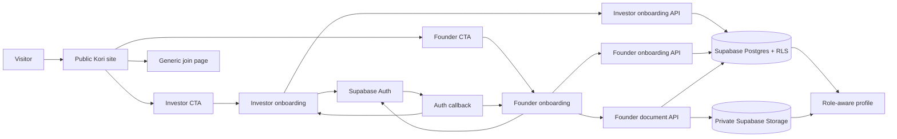
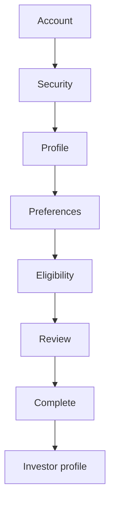
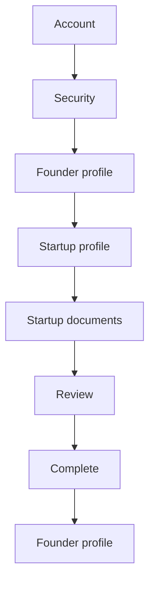
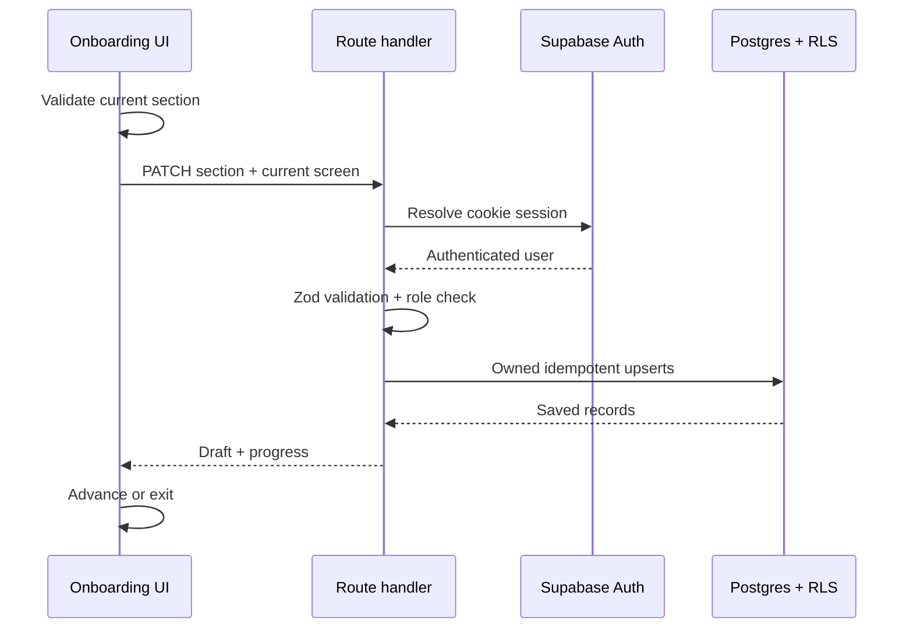
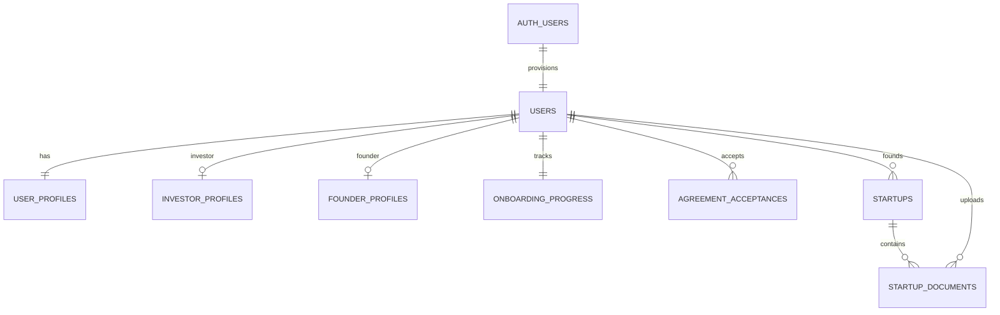

# Kori — Full Target Architecture

**Document:** `kori-a-f.md`  
**Date:** 2026-08-22  
**Project root:** `/Users/whererubeen/Documents/dev/kori-m`  
**Architecture state:** Target architecture, with current implementation status clearly identified

## 1. Purpose

This document describes the complete Kori MVP web architecture after integrating the existing public website with the approved `flow-in` Investor and Founder onboarding system.

It distinguishes:

- **Implemented:** code that currently exists in this project;
- **Staged:** source assets or design material already available but not integrated;
- **Planned:** approved architecture that still needs implementation;
- **Excluded:** product areas intentionally outside this MVP.

This is an architecture reference, not a claim that every target component already exists.

## 2. Source hierarchy

The target architecture is derived from these sources:

1. The current files in `/Users/whererubeen/Documents/dev/kori-m`.
2. `/Users/whererubeen/Downloads/kori-m(1).md` for the exact public-site migration.
3. `/Users/whererubeen/Downloads/flow-in(1).md` for onboarding scope, persistence, and security.
4. `/Users/whererubeen/Downloads/flow.md` for the Investor onboarding DOM, visual values, assets, and responsive behavior.
5. `docs/superpowers/specs/2026-08-22-flow-in-onboarding-integration-design.md` for approved integration decisions and resolution of source ambiguities.

Where the onboarding documents conflict, the approved integration design controls the implementation while preserving the non-negotiable visual-fidelity rules.

## 3. System summary

Kori is a Next.js App Router application with two primary surfaces:

1. A public marketing site that preserves the legacy Kori design and animation engine.
2. An authenticated MVP onboarding system for Investors, Fund Managers, and Founders, backed by Supabase Auth, Postgres, Row Level Security, and private Storage.

Admin users do not self-register. Community membership, deal execution, diligence, wallets, milestones, and capital rails remain outside this MVP.



## 4. Technology stack

### Current framework

| Layer | Technology |
|---|---|
| Web framework | Next.js `16.3.2`, App Router |
| UI runtime | React and React DOM `19.2.8` |
| Language | TypeScript with strict checking |
| Styling | Global CSS plus Tailwind CSS utilities without Preflight |
| Public animation | Original byte-preserved `public/kori.js` |
| Analytics | `@vercel/analytics` |
| Package manager | npm, with `package-lock.json` as the target lockfile |

### Onboarding additions

| Dependency | Responsibility |
|---|---|
| `@supabase/supabase-js` | Browser/server Auth, database, and Storage client |
| `@supabase/ssr` | Cookie-based App Router session handling |
| `zod` | Server and client onboarding validation |
| Node built-in test runner | Unit and contract tests without another test framework |

No UI component library or animation library is added.

## 5. Target project tree

```text
kori-m/
├── public/
│   ├── assets/
│   │   ├── onboarding/
│   │   │   ├── shared/
│   │   │   │   ├── check.svg
│   │   │   │   ├── chevron-down.svg
│   │   │   │   ├── eye-off.svg
│   │   │   │   ├── google.svg
│   │   │   │   ├── help-circle.svg
│   │   │   │   ├── kori-logo.svg
│   │   │   │   ├── linkedin.svg
│   │   │   │   └── user.svg
│   │   │   └── investor/
│   │   │       ├── avatar-1.png
│   │   │       ├── avatar-2.png
│   │   │       ├── avatar-3.png
│   │   │       ├── completion-mark.svg
│   │   │       ├── profile-cover.png
│   │   │       └── profile-photo.png
│   │   └── [existing public-site assets]
│   ├── join-form.js
│   └── kori.js
├── src/
│   ├── app/
│   │   ├── (auth)/
│   │   │   └── onboarding/
│   │   │       ├── investor/page.tsx
│   │   │       └── founder/page.tsx
│   │   ├── (app)/
│   │   │   └── profile/page.tsx
│   │   ├── api/
│   │   │   └── onboarding/
│   │   │       ├── investor/route.ts
│   │   │       └── founder/
│   │   │           ├── route.ts
│   │   │           └── documents/route.ts
│   │   ├── auth/
│   │   │   └── callback/route.ts
│   │   ├── about/page.tsx
│   │   ├── collective-intelligence/page.tsx
│   │   ├── communities/page.tsx
│   │   ├── founders/page.tsx
│   │   ├── how-kori-works/page.tsx
│   │   ├── investors/page.tsx
│   │   ├── join/page.tsx
│   │   ├── privacy/page.tsx
│   │   ├── terms/page.tsx
│   │   ├── globals.css
│   │   ├── layout.tsx
│   │   ├── not-found.tsx
│   │   ├── page.tsx
│   │   ├── robots.ts
│   │   └── sitemap.ts
│   ├── components/
│   │   ├── onboarding/
│   │   │   ├── shared/
│   │   │   │   ├── Editorial.tsx
│   │   │   │   ├── Shell.tsx
│   │   │   │   ├── Field.tsx
│   │   │   │   ├── SelectField.tsx
│   │   │   │   ├── Chips.tsx
│   │   │   │   ├── Choice.tsx
│   │   │   │   └── Completion.tsx
│   │   │   ├── investor/
│   │   │   │   ├── InvestorOnboarding.tsx
│   │   │   │   └── investor-onboarding.types.ts
│   │   │   ├── founder/
│   │   │   │   ├── FounderOnboarding.tsx
│   │   │   │   └── founder-onboarding.types.ts
│   │   │   └── profile/
│   │   │       ├── InvestorProfile.tsx
│   │   │       ├── FounderProfile.tsx
│   │   │       └── AdminEntry.tsx
│   │   ├── SiteFooter.tsx
│   │   ├── SiteFrame.tsx
│   │   └── SiteHeader.tsx
│   └── lib/
│       ├── onboarding/
│       │   ├── contracts.ts
│       │   └── redirects.ts
│       ├── supabase/
│       │   ├── client.ts
│       │   ├── server.ts
│       │   └── proxy.ts
│       └── validation/
│           ├── investor-onboarding.ts
│           └── founder-onboarding.ts
├── supabase/
│   └── migrations/
│       ├── 001_onboarding.sql
│       ├── 002_onboarding_rls.sql
│       └── 003_onboarding_storage.sql
├── tests/
│   └── onboarding/
│       ├── contracts.test.ts
│       ├── redirects.test.ts
│       └── validation.test.ts
├── .env.example
├── .gitignore
├── eslint.config.mjs
├── next-env.d.ts
├── next.config.ts
├── package-lock.json
├── package.json
├── postcss.config.mjs
├── proxy.ts
├── README.md
├── supabase-waiting-list.sql
└── tsconfig.json
```

## 6. Application layers

### 6.1 Public presentation layer

The public site is server-rendered through App Router pages and shared `SiteFrame`, `SiteHeader`, and `SiteFooter` components. Its original CSS is consolidated in `src/app/globals.css`.

Normal `<a>` navigation is intentional. Full-document navigation reinitializes the unchanged legacy IIFE animation script. Plain `` elements preserve the legacy loading, cropping, and rendering behavior.

### 6.2 Onboarding presentation layer

Investor and Founder onboarding are client-driven multi-screen interfaces. Shared visual primitives preserve the supplied DOM structure, class names, typography, spacing, color values, breakpoints, and plain image rendering.

`InvestorOnboarding` and `FounderOnboarding` own only flow composition, local draft state, validation feedback, save/resume behavior, and API/auth calls. Reusable layout and form rendering remain in focused shared components.

### 6.3 Route-handler layer

Next.js route handlers form the trusted application boundary. They:

- derive identity from the Supabase cookie session;
- reject missing sessions or incorrect roles;
- validate payloads with Zod;
- derive ownership fields from the authenticated user rather than request data;
- perform idempotent upserts;
- translate persistence errors into safe HTTP responses;
- never expose a service-role key.

### 6.4 Supabase integration layer

- `client.ts` creates the browser client for signup, OAuth, OTP, and enabled MFA operations.
- `server.ts` creates the cookie-aware server client for route handlers and server components.
- `proxy.ts` refreshes auth cookies for server-rendered requests.
- root `proxy.ts` applies session refresh and profile-route protection.

### 6.5 Persistence layer

Postgres stores users, role profiles, startup records, agreements, document metadata, and onboarding progress. RLS ensures that authenticated users can access only their own records. Private Storage holds profile photos and startup documents.

## 7. Route architecture

### Public routes

| Route | Responsibility | Status |
|---|---|---|
| `/` | Landing page | Implemented |
| `/about` | Company and team | Implemented |
| `/collective-intelligence` | Collective-intelligence proposition | Implemented |
| `/communities` | Community proposition | Implemented |
| `/founders` | Founder proposition and Founder CTA | Implemented; CTA update planned |
| `/how-kori-works` | Operating model | Implemented |
| `/investors` | Investor proposition and Investor CTA | Implemented; CTA update planned |
| `/join` | Generic non-role waiting-list form | Implemented |
| `/privacy` | Privacy policy | Implemented |
| `/terms` | Terms | Implemented |
| `/robots.txt` | Crawl rules | Implemented |
| `/sitemap.xml` | Public URL inventory | Implemented |

The generic Join page remains for community leads, expert/operators, ecosystem partners, and other labels that are not persistent MVP roles.

### Onboarding and authenticated routes

| Route | Access | Responsibility | Status |
|---|---|---|---|
| `/onboarding/investor` | Public/session-aware | Investor and Fund Manager onboarding | Planned |
| `/onboarding/founder` | Public/session-aware | Founder and startup onboarding | Planned |
| `/profile` | Authenticated | Role-aware completed profile | Planned |
| `/auth/callback` | Public callback | OAuth/code exchange and safe redirect | Planned |

There is no `/onboarding/admin` route.

## 8. Investor flow



### Screens

1. **Account:** email/password, Google, LinkedIn, country, terms, and newsletter preference.
2. **Security:** email OTP, authenticator/TOTP, SMS backup when enabled, and a disabled passkey option by default.
3. **Profile:** photo, languages, legal name, location, LinkedIn, title, organization, and biography.
4. **Preferences:** expertise, ask-me-about, regions, stages, ticket size, instruments, horizon, and thesis.
5. **Eligibility:** self-declared classification, experience, source of funds, and risk acknowledgement.
6. **Review:** profile, preferences, eligibility, agreements, electronic signature, and signature date.
7. **Complete:** completion checklist and link to `/profile`.
8. **User profile:** database-backed profile with empty states for excluded downstream investment data.

### Investor invariants

- `role=investor`.
- Fund Manager is `investor_type=fund_manager`, not another role.
- KYC is visible as deferred and non-blocking.
- The server forces `verification_status=deferred`.
- The client cannot submit an Admin role or its own database user ID.

## 9. Founder flow



### Screens

1. **Account:** the same auth controls as Investor with `role=founder`.
2. **Security:** the same enabled-factor behavior as Investor.
3. **Founder Profile:** photo, languages, legal name, location, LinkedIn, title, and biography.
4. **Startup Profile:** legal/display name, country, sector, website, description, founding year, and stage.
5. **Startup Documents:** pitch deck, company overview, and supporting documents.
6. **Review:** founder, startup, documents, agreements, signature, and signature date.
7. **Complete:** completion checklist and link to `/profile`.

Founder screens reuse the Investor source’s visual primitives. No separate visual language is introduced.

## 10. Authentication architecture

### Roles

Persistent roles are:

```text
founder
investor
admin
```

Public signup metadata accepts only `founder` or `investor`. The database trigger defaults unrecognized metadata to `investor` and never provisions Admin.

### Email/password and OTP

Account creation uses Supabase Auth signup with fixed route-derived role metadata. The email verification screen verifies the signup OTP. After authentication, enabled second-factor enrollment can begin.

### OAuth

- Google provider: `google`
- LinkedIn provider: `linkedin_oidc`

Both return through `/auth/callback`. The callback exchanges the authorization code and allows redirects only to:

```text
/onboarding/investor
/onboarding/founder
/profile
```

All other redirect values fall back to `/join`.

### Session enforcement

- Onboarding entry pages remain public so signup can start.
- Onboarding APIs require an authenticated session.
- `/profile` requires a session.
- API routes independently verify role and ownership even when proxy protection is present.

## 11. Draft and save/resume architecture

Each onboarding controller owns a typed local draft. An authenticated initial `GET` hydrates stored data and `current_screen`.

Continue and Save and exit follow the same persistence path:



A failed save does not advance the screen. The UI retains entered values and exposes an accessible status message.

Completion updates the role profile to `completed`, sets `completed_at`, records the final progress state, and enables the profile destination.

## 12. API contracts

| Method and path | Input | Output | Security |
|---|---|---|---|
| `GET /api/onboarding/investor` | Cookie session | Investor draft, agreements, verification, progress | Investor only |
| `PATCH /api/onboarding/investor` | Screen plus profile/preferences/eligibility/agreements/completion section | Saved draft and progress | Investor only; KYC forced deferred |
| `GET /api/onboarding/founder` | Cookie session | Founder profile, startup, documents, agreements, progress | Founder only |
| `PATCH /api/onboarding/founder` | Screen plus profile/startup/agreements/completion section | Saved draft and progress | Founder only |
| `POST /api/onboarding/founder/documents` | Multipart startup ID, category, title, file | Document metadata | Founder and owned startup only |

### HTTP error model

| Status | Meaning |
|---|---|
| `400` | Invalid field or upload payload |
| `401` | Missing authenticated session |
| `403` | Wrong role or resource ownership failure |
| `404` | Required owned record does not exist |
| `503` | Supabase environment is not configured |
| `500` | Unexpected persistence or storage failure |

Server logs exclude passwords, OTPs, tokens, signatures, uploaded bytes, and personal profile values.

## 13. Database architecture



### Tables

| Table | Key responsibility |
|---|---|
| `users` | Auth-linked identity, email, role, verification status |
| `user_profiles` | Shared legal, location, professional, language, and photo data |
| `investor_profiles` | Investor type, thesis, preferences, eligibility, risk, and completion |
| `founder_profiles` | Founder onboarding state and completion |
| `startups` | Founder-owned startup identity and MVP business profile |
| `startup_documents` | Private document metadata and storage path |
| `onboarding_progress` | Flow type, current screen, completed screens, last save |
| `agreement_acceptances` | Versioned agreement acceptance and electronic signature metadata |

### Enums

- `user_role`: `founder`, `investor`, `admin`
- `verification_status`: `deferred`, `not_started`, `pending`, `approved`, `rejected`
- `onboarding_status`: `not_started`, `in_progress`, `completed`
- `investor_type`: `individual`, `fund_manager`

### Migrations

1. `001_onboarding.sql`: extension, enums, tables, indexes, and auth-user trigger.
2. `002_onboarding_rls.sql`: table RLS and user-owned policies.
3. `003_onboarding_storage.sql`: private buckets and object policies.

These migrations are repository artifacts only until a Supabase project is connected and explicitly authorized for mutation.

## 14. Row Level Security

RLS is enabled on every onboarding table.

Core rules:

- a user can read their own `users` row;
- a user owns their shared profile and onboarding progress;
- an Investor owns only their Investor profile;
- a Founder owns only their Founder profile and startup;
- startup document access requires ownership through the Founder user;
- agreement reads/inserts are limited to the authenticated user;
- no browser operation can elevate a user to Admin.

The authenticated user ID comes from `auth.uid()`, never from an accepted client identity field.

## 15. Storage architecture

### Buckets

| Bucket | Visibility | Responsibility |
|---|---|---|
| `profile-photos` | Private | User-owned profile images rendered through controlled access |
| `startup-data-room` | Private | Founder-owned startup onboarding documents |

### Founder upload constraints

- Maximum file size: 10 MB.
- Categories: `pitch_deck`, `company_overview`, `supporting_document`.
- MIME allowlist: PDF, DOC, DOCX, PNG, JPEG.
- Storage path: user and startup scoped.
- Startup ownership is checked before upload.
- Metadata is inserted only after successful upload.
- Metadata failure triggers best-effort removal of the uploaded object.

No Investor, community, deal, or diligence access to startup documents is included.

## 16. Profile architecture

`/profile` is server-rendered and role-aware:

```text
users.role
├── investor → InvestorProfile
├── founder  → FounderProfile
└── admin    → AdminEntry
```

Unauthenticated or unconfigured requests redirect to `/join`. Authenticated users with incomplete onboarding records redirect to the route matching their stored role.

Investor profile styling follows the source UserProfile design, but unsupported portfolio, contribution, mutual-context, wallet, or completed-KYC claims become honest empty states. Founder profile uses the same Kori visual primitives and shows only supported Founder/startup information.

## 17. Asset and CSS architecture

### Public site

The existing public-site asset tree, `public/kori.js`, and `public/join-form.js` remain unchanged.

### Onboarding

Onboarding source assets are copied byte-for-byte into the namespaced directories shown in the target tree. Components use plain `` elements and the new asset URLs.

All onboarding selectors live in `src/app/globals.css` beneath `.kori-onboarding`. Declaration values and breakpoints from `flow.md` remain unchanged; only selector scope changes to prevent collisions with the public site.

Global source rules are adapted as follows:

```text
:root                  → .kori-onboarding
*                      → .kori-onboarding *
button,input,select    → scoped descendants
.account-page          → .kori-onboarding .account-page
all other classes      → .kori-onboarding descendants
```

The wrapper has no independent layout declarations. Tailwind and Google font imports remain singletons.

## 18. Environment configuration

`.env.example` defines:

```bash
NEXT_PUBLIC_SUPABASE_URL=
NEXT_PUBLIC_SUPABASE_PUBLISHABLE_KEY=

KYC_REQUIRED=false

NEXT_PUBLIC_ENABLE_PASSKEY=false
NEXT_PUBLIC_ENABLE_SMS_MFA=true
NEXT_PUBLIC_SHOW_FIGMA_SCREEN_SWITCHER=false
```

### No-credential behavior

- Public and onboarding pages render.
- Auth actions show a configuration message.
- Onboarding APIs return `503` JSON.
- `/profile` redirects to `/join`.
- Build and static checks do not require secrets.
- No fake production credential is committed.

Passkey remains visible but disabled while its flag is false. This MVP does not invent a WebAuthn server/provider.

## 19. Public CTA integration

Only destinations change:

```text
Investor page: “Join as an investor” → /onboarding/investor
Founder page:  “Raise on Kori”        → /onboarding/founder
```

Existing wording, styling, markup hierarchy, and animation classes remain unchanged. `/join` continues serving non-persistent personas.

## 20. Testing and verification architecture

Node `22.22.2` is available. Pure contracts and schemas use the built-in Node test runner with type-strippable TypeScript, avoiding another dependency.

### Automated coverage

- public role allowlisting and Admin rejection;
- Investor and Founder Zod schemas;
- server-forced KYC deferral;
- UI-to-database mapping;
- OAuth callback redirect allowlisting;
- upload category, MIME, size, and ownership validation;
- missing-environment behavior;
- onboarding progress and completion transitions.

### Project checks

```bash
npm test
npm run typecheck
npm run lint
npm run build
```

Runtime smoke checks cover:

- both onboarding pages without credentials;
- controlled API `503` responses without credentials;
- callback rejection of unsafe redirects;
- protected profile behavior;
- updated public CTA targets;
- absence of `/onboarding/admin`.

No live OAuth, MFA, RLS, database, or Storage acceptance claim is made until a Supabase project is configured and migrations are applied.

## 21. Deployment architecture

The target deployment is a standard Next.js server deployment, such as Vercel, with Supabase as an external managed service.

Deployment requirements:

1. Set the public Supabase URL and publishable key.
2. Apply the three migrations to the intended Supabase project.
3. Configure Google and LinkedIn OIDC providers and callback URLs.
4. Configure email OTP behavior and allowed redirect origins.
5. Enable TOTP and SMS MFA capabilities required by the environment.
6. Keep passkey disabled until a server/provider architecture is approved.
7. Build and run the complete verification suite.

The browser receives only the publishable Supabase key. Authorization relies on Auth sessions, server validation, and RLS rather than key secrecy.

## 22. Current implementation status

### Implemented now

- Exact Next.js public-site routes and shared site frame.
- Byte-preserved public animation and Join scripts.
- Current public-site assets.
- Metadata routes, privacy, terms, and not-found page.
- Pinned Next.js/React/Tailwind framework versions.
- Approved `flow-in` integration design document.

### Staged now

- All onboarding source icons and raster assets exist in `public/assets/` at the legacy flat paths.
- `/Users/whererubeen/Downloads/flow.md` contains the exact Investor component and CSS source.
- `/Users/whererubeen/Downloads/flow-in(1).md` contains database and onboarding requirements.

### Planned but not implemented

- Namespaced onboarding asset directories.
- Investor and Founder routes/components.
- Role-aware profile route.
- Supabase client/server/proxy utilities.
- Auth callback and session proxy.
- Onboarding APIs and validation.
- SQL/RLS/Storage migrations.
- `.env.example`.
- CTA destination updates.
- Onboarding tests.
- Supabase dependencies.
- The narrow ESLint exception for intentional public-site anchors.

### Known workspace state

- The directory currently has no `.git` repository, so this architecture document is not committed.
- Both `package-lock.json` and `pnpm-lock.yaml` are currently present; the target architecture standardizes on npm and `package-lock.json`.
- The current full lint command reports errors for intentionally preserved full-document anchors; the target config disables only that conflicting rule.

## 23. Explicit MVP exclusions

The following are not part of this architecture milestone:

- community onboarding or membership;
- deal creation or lifecycle;
- collective diligence workflows;
- investment commitments;
- milestone approvals;
- capital release or settlement;
- wallets or multisig;
- KYC provider integration;
- Investor access to Founder data rooms;
- public Admin registration;
- a functional passkey provider;
- a dedicated Founder visual design;
- visual-regression or end-to-end acceptance suites.

These exclusions must not be represented with fabricated data or placeholder business behavior.

## 24. Architectural invariants

1. Public-site visual and behavioral fidelity remains intact.
2. Onboarding source declaration values and responsive breakpoints remain intact.
3. Onboarding CSS cannot leak into public pages.
4. Admin cannot be assigned through public signup metadata.
5. User IDs and ownership fields come from the authenticated session.
6. KYC remains deferred and non-blocking.
7. Fund Manager remains an Investor subtype.
8. Founder documents remain private and Founder-owned.
9. No service-role key reaches application code or the browser.
10. Missing Supabase credentials cannot crash rendering or builds.
11. Unsupported investment and trust data appears only as an honest empty state.
12. No excluded workflow is started implicitly by onboarding completion.
