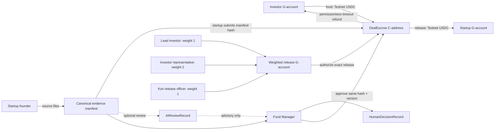

# Kori Stellar — AI context

Use this page as the shortest reliable entry point for developers, Copilot, and
nontechnical teammates.

## Current truth

- Kori V1 uses one immutable Soroban `DealEscrow` per deal.
- Investors transfer the pinned official **Stellar Testnet USDC SAC** into the
  escrow C-address. The weighted release G-account authorizes payout but never
  holds deal funds.
- The startup submits the hash of a canonical source-evidence manifest. AI and
  human decision records separately reference the confirmed hash/version; they
  never feed back into its preimage. AI remains advisory, and the Fund Manager
  approves the exact manifest hash and version.
- Release requires the Investor Representative plus either the Lead Investor
  (normal path) or Kori Release Officer (recovery path). Lead + Kori is rejected.
- After the applicable immutable deadline, anyone may advance the refund path;
  each refund can only return to its original investor.
- The contract, 23 local tests, weighted authority, and five live Testnet
  assurance scenarios are complete. This is not Mainnet or production-ready.

## Evidence map

| Question                             | Source of truth                                                                                                                              |
| ------------------------------------ | -------------------------------------------------------------------------------------------------------------------------------------------- |
| What happened on Testnet?            | [`TESTNET_ASSURANCE_REPORT.md`](./TESTNET_ASSURANCE_REPORT.md) and [`deployments/testnet-v1.json`](./deployments/testnet-v1.json)            |
| What does the contract enforce?      | [`contracts/kori-deal-escrow/src/lib.rs`](./contracts/kori-deal-escrow/src/lib.rs) and [`test.rs`](./contracts/kori-deal-escrow/src/test.rs) |
| What has the team decided?           | [`PRD.md`](./PRD.md)                                                                                                                         |
| What changed from EVM?               | [`ARCHITECTURE_MIGRATION.md`](./ARCHITECTURE_MIGRATION.md)                                                                                   |
| How should the system be visualized? | [`FIGMA_REFERENCE.md`](./FIGMA_REFERENCE.md) and the linked FigJam board                                                                     |
| Which public demo identities exist?  | [`deployments/testnet-v1.json`](./deployments/testnet-v1.json); private signing material is excluded from the active reference tree         |

When sources disagree, distinguish live evidence, enforced code, product intent,
and deferred work. Do not blend them into one claim.

## Current boundary

Implemented: contract custody, exact-target funding, versioned evidence hash,
Fund Manager approval, weighted release authorization, exact release,
permissionless per-investor refunds, events, local tests, and live Testnet
assurance.

The application has a narrow Testnet wallet funding demo; this is not complete
application integration or production proof. Evidence storage, AI integration,
event-indexer operations, production identity/compliance,
legal SPV operations, independent security audit, Mainnet asset/custody policy,
monitoring, and incident response remain deferred.

## Non-circular evidence rule

1. Build and hash the canonical source-evidence manifest.
2. Confirm `submit_evidence(manifest_hash)` on-chain.
3. Store AI review and Fund Manager decision records as downstream references to
   the confirmed hash/version.
4. Approve only that same current hash/version.

AI output and human decision data are never inputs to `manifest_hash`. A new
submission creates a new manifest revision; prior reviews and decisions remain
auditable but stale for approval. AI is optional decision support: provider
failure must not block human review, deadline progression, or refunds.

## Useful questions for Copilot

- “Where are funds held, and who can release them?”
- “Which release signer combinations passed and failed on Testnet?”
- “Show the normal release transaction story with links.”
- “What happens if funding or release misses its deadline?”
- “Is this production-ready? Separate implemented facts from remaining work.”
- “Does the FigJam board still match the deployed Testnet status?”
