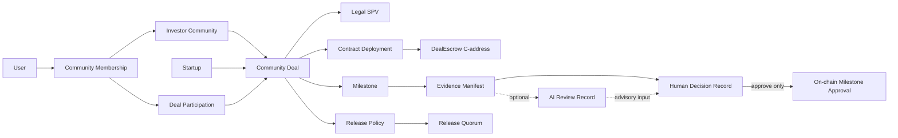

# Kori Stellar/Soroban PRD

## Document control

| Field             | Value                                                          |
| ----------------- | -------------------------------------------------------------- |
| Status            | Approved V1 Testnet contract and application demo handoff      |
| Audience          | Kori developers, reviewers, and coding agents                  |
| Scope             | Stellar/Soroban blockchain path and its application boundaries |
| Last verified     | 2026-09-05                                                     |
| Target network    | Stellar Testnet only for the MVP                               |
| Production status | Not production-ready; no real funds                            |

This document is the blockchain product and implementation reference. It
supersedes older blockchain sections that prescribe Ethereum Sepolia, MetaMask,
or Safe. It does not turn an item marked **OPEN** or **PROPOSED** into an
approved product decision.

## 1. How to use this PRD

Labels are normative:

- **DECIDED**: current product or architecture direction.
- **IMPLEMENTED**: present in code and verified by tests or inspection.
- **REQUIRED**: acceptance criterion for the target MVP.
- **PROPOSED**: recommended design, awaiting explicit confirmation.
- **OPEN**: a decision is still required.
- **HISTORICAL**: useful context that must not drive new implementation.

Source precedence:

1. Explicit team decisions recorded in this PRD and the current
   [FigJam architecture](https://www.figma.com/board/FlcuMidYV5TAuMDfBc8l6o/Kori-Stellar-Architecture-%E2%80%94-Custody--Governance-and-Data?node-id=0-1).
2. Contract code and tests for implementation truth, not product intent.
3. Latest relevant team meetings and reviewed product flows.
4. [Architecture migration notes](./ARCHITECTURE_MIGRATION.md).
5. Older Sepolia/EVM documents, which are historical references only.

When sources conflict, do not silently choose one. Record the conflict here and
obtain a decision from the responsible product, blockchain, or legal owner.

### Agent/developer boot sequence

1. Read [`AGENTS.md`](../../AGENTS.md), this PRD, the package
   [README](./README.md), and the
   [architecture migration notes](./ARCHITECTURE_MIGRATION.md).
2. Inspect `git status`, the current branch, and recent commits. Preserve
   unrelated or pre-existing changes.
3. Read the [contract](./contracts/kori-deal-escrow/src/lib.rs) and
   [tests](./contracts/kori-deal-escrow/src/test.rs); never infer behavior from
   UI copy or a diagram alone.
4. Run the current validation commands before and after contract changes.
5. Update the implementation matrix and open decisions in this PRD in the same
   pull request when behavior changes.
6. Do not generate keys, deploy, push, merge, use real assets, or change external
   systems unless the task explicitly authorizes that action.

## 2. Executive summary

Kori demonstrates milestone-based private-market investment funding. Investors
fund a deal-specific escrow, a startup submits milestone evidence, a Fund
Manager makes the human evidence decision, and a separate release quorum
authorizes the payout. AI advisory is a future off-chain capability and is not
implemented in the V1 demo.

The selected Stellar model is:

1. Constructor fixes the startup, Fund Manager, weighted release account, exact
   target, funding deadline, and release deadline.
2. Each investor signs `fund`; USDC moves atomically into DealEscrow custody.
3. Reaching the exact target closes funding; overfunding is rejected.
4. Kori hashes a canonical source-evidence manifest, and the startup signs
   submission of that manifest hash.
5. Any future AI and human-review records remain separate off-chain references
   to the confirmed manifest hash/version; they never change its preimage.
6. The Fund Manager/Lead Investor approves that exact manifest hash and version.
7. The Investor Representative plus either the Lead Investor or Kori Release
   Officer authorizes the exact payout through a weighted Stellar G-account.
8. DealEscrow transfers exactly the target to the immutable startup address.
9. If no valid release occurs by the applicable deadline, anyone may trigger
   per-investor refunds to the original funding addresses.

The deal contract holds the money; the multisig governs release. This is not a
treasury account holding the money, and it is not a revocable allowance that is
mislabelled as funded capital.

## 3. Architecture decisions

| ID     | Status      | Decision                                                                                                                                                                                                                           |
| ------ | ----------- | ---------------------------------------------------------------------------------------------------------------------------------------------------------------------------------------------------------------------------------- |
| AD-001 | **DECIDED** | New blockchain work targets Stellar/Soroban. EVM remains a historical reference implementation.                                                                                                                                    |
| AD-002 | **DECIDED** | Each deal uses contract custody: USDC is held at the `DealEscrow` C-address.                                                                                                                                                       |
| AD-003 | **DECIDED** | Investor funding is an actual SAC transfer, not a deferred `approve`/allowance or delegated wallet pull.                                                                                                                           |
| AD-004 | **DECIDED** | The MVP accepts one configured USDC SAC; asset identity includes the network and contract address.                                                                                                                                 |
| AD-005 | **DECIDED** | Each V1 escrow covers one deal, one startup, one milestone, and one full release. The application demo uses three independently deployed escrows/SPVs.                                                                             |
| AD-006 | **DECIDED** | Fund Manager is a contextual community/deal role held by an investor, not a global `User.isFundManager` identity.                                                                                                                  |
| AD-007 | **DECIDED** | Human evidence approval and financial release authorization are separate responsibilities.                                                                                                                                         |
| AD-008 | **DECIDED** | AI is advisory only and has no on-chain address, key, approval, or release power.                                                                                                                                                  |
| AD-009 | **DECIDED** | There is no separate independent-verifier role in the current flow; the Fund Manager is the human milestone approver.                                                                                                              |
| AD-010 | **DECIDED** | A legal SPV and a smart contract are distinct objects linked to the same deal. A contract is not a legal vehicle.                                                                                                                  |
| AD-011 | **DECIDED** | Direct-deploy one immutable escrow for V1; a multi-deal factory is V2.                                                                                                                                                             |
| AD-012 | **DECIDED** | Release uses a weighted G-account. Investor Representative is mandatory: Lead + Representative is normal; Kori + Representative is recovery after prior Lead approval; Lead + Kori is forbidden.                                   |
| AD-013 | **DECIDED** | Constructor fixes absolute funding/release deadlines. Timeout refunds are permissionless, per investor, and can only pay the original funding address.                                                                             |
| AD-014 | **DECIDED** | In V1, the immutable startup payout address signs each on-chain evidence-hash submission; documents remain off-chain.                                                                                                              |
| AD-015 | **DECIDED** | V1 exposes no configuration setter or contract-upgrade entry point. Production upgrade governance is V2/security review work.                                                                                                      |
| AD-016 | **V2**      | Community voting/quorum may select deals later but never replaces each investor's authorization of an exact contribution.                                                                                                          |
| AD-017 | **DECIDED** | V1 uses `minimum = target = maximum`; target is the full release amount and contributions above it are rejected.                                                                                                                   |
| AD-018 | **DECIDED** | If the Lead disappears before approval, the startup is not paid; the deal becomes refundable at the release deadline.                                                                                                              |
| AD-019 | **DECIDED** | The on-chain evidence hash commits only to the canonical source-evidence manifest. AI review and Fund Manager decision records are downstream, append-only references to that hash/version and are never included in its preimage. |

## 4. Product boundary

### Goals

- Prove that investor funding corresponds to an atomic on-chain USDC transfer.
- Attribute every accepted contribution to the authorizing investor.
- Keep evidence and AI analysis off-chain while anchoring the source-evidence
  manifest without hashing downstream AI or human-review data.
- Require a human milestone decision and separate quorum-controlled payout.
- Prevent early release, unauthorized release, over-release, and double release.
- Produce sufficient events for an auditable off-chain projection.
- Provide a reproducible local, Quickstart, and Testnet developer path.

### Non-goals for the MVP

- Mainnet or real-money use.
- Legal formation or administration of an SPV.
- Tokenized equity, cap-table ownership, securities issuance, or yield.
- Fiat conversion, on-ramp, off-ramp, CCTP, or cross-chain settlement.
- Production KYC/KYB, AML, sanctions, tax, or regulatory automation.
- Multiple milestones, partial tranches, multiple assets, or a deal factory.
- Variable minimum/target/maximum amounts, manual early close, or overfunding.
- Non-timeout cancellation, dispute resolution, or discretionary admin refunds.
- On-chain evidence documents or personally identifiable information.
- AI-controlled approvals or transactions.
- A reusable custom smart-wallet/account protocol.

## 5. Domain model

The reusable community and the deal-specific investment must remain separate.
One community can participate in several deals; one startup can receive funding
through several community deals or legal vehicles.



| Entity                | Meaning and required boundary                                                                                                          |
| --------------------- | -------------------------------------------------------------------------------------------------------------------------------------- |
| `User`                | Person/account identity. Base identity may be investor or founder; do not add a global fund-manager boolean.                           |
| `CommunityMembership` | User's scoped role in one community, such as member, manager, or lead investor. A user may have different roles across communities.    |
| `InvestorCommunity`   | Reusable group of investors. It is not a wallet, deal, SPV, or startup.                                                                |
| `CommunityDeal`       | Aggregate root for one community investing in one funding opportunity/round for one startup.                                           |
| `DealParticipation`   | One member's committed and funded amounts for one deal. A membership balance is not a substitute.                                      |
| `Startup`             | Company/founder context. One startup may have multiple rounds/deals.                                                                   |
| `LegalSPV`            | Optional legal vehicle and agreements associated with the deal. It does not execute code.                                              |
| `ContractDeployment`  | Network, contract ID, Wasm hash/version, constructor configuration, deployment transaction, and active status for a deal.              |
| `Milestone`           | Business criterion and release policy. The current MVP has exactly one.                                                                |
| `EvidenceManifest`    | Canonical, versioned inventory of source evidence. Its digest excludes all later AI and human-review data.                             |
| `AIReviewRecord`      | Optional append-only advisory output referencing one manifest hash/version, with model, prompt, output, citation, and provenance data. |
| `HumanDecisionRecord` | Append-only Fund Manager decision referencing one manifest hash/version and, when used, one AI review record.                          |
| `MilestoneApproval`   | Confirmed on-chain approval binding the current manifest hash/version, Fund Manager, exact amount, and ledger data.                    |
| `ReleasePolicy`       | Required authority, threshold, amount, recipient, and valid state for payout.                                                          |
| `ChainEvent`          | Immutable indexed network event identified by network, contract, ledger, transaction, and event ID.                                    |

Amounts shown at community, SPV, or startup level are derived aggregates. The
source of truth is each confirmed deal participation/funding event in one
explicit asset.

## 6. Actors and authority

| Actor                             | May do                                                                                                                     | Must not do                                                                 |
| --------------------------------- | -------------------------------------------------------------------------------------------------------------------------- | --------------------------------------------------------------------------- |
| Investor                          | Select a deal, authorize an exact contribution, view funded position, claim an eligible refund                             | Move another investor's assets or approve a milestone by default            |
| Startup Founder                   | Upload source evidence and sign submission of its canonical manifest hash                                                  | Approve its own evidence or release funds                                   |
| Fund Manager / Milestone Approver | Review source evidence and AI advice; record a decision and approve the current manifest hash/version for an assigned deal | Gain release power merely from community-admin status                       |
| Investor Representative           | Co-authorize every release through the weighted release account                                                            | Release alone or approve evidence                                           |
| Kori Release Officer              | Replace the Lead only for release after the Lead already approved the exact evidence                                       | Approve evidence, release alone, or bypass the Investor Representative      |
| Kori Operator                     | Deploy reviewed contracts, submit public refund calls, and operate the indexer                                             | Redirect refunds or gain discretionary escrow control                       |
| AI Review                         | Produce structured advisory findings off-chain                                                                             | Hold keys, call the contract, approve, reject, or release                   |
| Legal/Compliance operator         | Determine eligibility and maintain legal records off-chain                                                                 | Treat a smart contract as formation of an SPV or proof of investment rights |
| Stablecoin issuer                 | Operates the asset and may retain issuer controls                                                                          | Is not controlled by Kori                                                   |

Custody, control, and authority are different:

- **Custody location:** the DealEscrow C-address holds the SAC balance.
- **Business approval:** the Fund Manager approves the evidence.
- **Financial authorization:** the release quorum authorizes payout.
- **Execution:** DealEscrow enforces state and calls the SAC.
- **Legal rights:** the SPV and agreements define investor rights off-chain.

Release-account policy:

| Signers                        | Result                                       |
| ------------------------------ | -------------------------------------------- |
| Lead + Investor Representative | Allowed normal release                       |
| Kori + Investor Representative | Allowed recovery release after Lead approval |
| Lead + Kori                    | Forbidden                                    |
| Any single signer              | Forbidden                                    |

Recommended V1 weights are Lead `1`, Investor Representative `2`, Kori `1`,
medium threshold `3`, master weight `0`, and high threshold `4`. This makes the
Representative mandatory for release and all three parties mandatory for signer
or threshold changes. The contract authenticates the release G-account; the
account configuration enforces the underlying pair.

## 7. System architecture

### On-chain

- Investor and startup G-accounts.
- One verified USDC Stellar Asset Contract.
- One deal-specific `DealEscrow` C-address.
- Immutable V1 target, deadlines, payout recipient, and authorities.
- Contribution, evidence-approval, release, and refund state.
- Structured events for every financial/state transition.
- Native Stellar G-account authorization for the release quorum.

### Kori off-chain platform

Implemented for V1:

- Web application and authenticated/public deal workspaces.
- Wallet connection, transaction simulation, assembly, signing, submission,
  confirmation polling, and direct ledger reads.
- Browser-local/exportable canonical evidence manifests.
- Product roles and self-declared investment eligibility; no KYC workflow.

Deferred platform hardening:

- Operational database projections, never an alternative money ledger.
- Private evidence object storage and shared manifest persistence.
- Append-only AI review and human decision records that reference a manifest
  hash/version.
- AI advisory service with no wallet or on-chain authority.
- Stellar event indexer with replay and deduplication.

### Legal/compliance

- SPV formation, documents, investor rights, and deal terms.
- KYC/KYB, AML/sanctions, suitability, jurisdiction, and disclosures.
- Dispute, cancellation, refund, and loss-allocation rules.

These are unresolved production workstreams. Testnet code must not imply they
are solved.

## 8. Required user and transaction flows

### 8.1 Deal configuration and deployment

1. Kori creates a canonical off-chain deal ID and terms/evidence schema version.
2. Product/legal owners provide the startup recipient and applicable deal terms.
3. Blockchain owner verifies network and USDC SAC identity.
4. The team assigns the deal-scoped Fund Manager and verifies the weighted
   release account against AD-012.
5. Kori fixes one positive target and two absolute Unix timestamps where
   `now < funding_deadline < release_deadline`.
6. Kori verifies the startup can receive USDC and deploys one escrow with the
   reviewed constructor arguments.
7. Kori records network, contract ID, Wasm hash, constructor values, deployment
   transaction, and ledger.
8. No constructor value may be silently inferred from UI language, country, or
   wallet defaults.

### 8.2 Investor funding

1. Investor selects one deal and exact base-unit amount.
2. Any community selection vote is checked off-chain, but does not authorize
   spending from the investor's account.
3. The app reads the latest deal state and simulates the invocation.
4. The wallet shows and signs the complete `fund` authorization tree.
5. `fund` requires investor authorization.
6. DealEscrow calls SAC transfer from investor to escrow in the same invocation.
7. Contribution and aggregate accounting update atomically with the transfer.
8. A contribution exceeding the target is rejected; reaching the target moves
   the deal atomically to `Funded`.
9. DealEscrow emits `Funded` and, when applicable, `FundingCompleted`.
10. A future indexer records events only after successful confirmed execution;
    V1 reads confirmed state directly through Soroban RPC.
11. The UI derives “funded” from confirmed chain evidence, never from a pending
    database row, allowance, signature request, or commitment.

### 8.3 Evidence and human approval

1. Startup uploads a draft source-evidence package off-chain.
2. Kori builds a canonical manifest from fields already known at this point and
   computes `manifest_hash`.
3. The app reads the current chain version. The startup signs
   `submit_evidence(manifest_hash)`; a confirmed invocation assigns the next
   on-chain evidence version.
4. V1 displays the confirmed hash/version and transaction in the active browser
   session. Durable shared recording is deferred. A failed or stale submission
   remains an unanchored draft and is not current evidence.
5. In a future iteration, AI may read the exact anchored source package and write an append-only
   `AIReviewRecord` referencing the same hash/version. An AI failure or omission
   does not block human review, approval, release timeout, or refunds.
6. The Fund Manager inspects the matching exported manifest and source files.
   Durable `HumanDecisionRecord` persistence and any advisory record are
   deferred; neither is required for the V1 on-chain approval.
7. A rejection remains off-chain and may lead to a new evidence revision. An
   approval requires the Fund Manager to sign
   `approve_milestone(manifest_hash, evidence_version)`.
8. The chain stores only the manifest hash, version, approval state, exact
   release amount, and ledger data. It stores neither AI findings nor the human
   reason.
9. Every history is append-only. A new manifest revision makes prior reviews and
   decisions stale for approval but never rewrites them.

### 8.4 Release

1. The app constructs `release(evidence_hash, evidence_version, target_amount)`.
2. Lead + Representative normally authorize the weighted G-account. If the Lead
   already approved evidence but is unavailable, Kori + Representative may do so.
3. DealEscrow checks evidence approval, release arguments, balance/accounting,
   recipient, and current state.
4. DealEscrow marks the terminal state and transfers USDC atomically.
5. DealEscrow emits `Released` with the amount and evidence reference.
6. V1 refreshes confirmed state directly through Soroban RPC. A future indexer
   projects transaction identifiers and history durably.

The approval is immutable and the release authorization is bound to the exact
contract invocation. Kori cannot create the prerequisite Lead approval.

### 8.5 Refund/cancellation

Exact deadline values are deployment inputs. Non-timeout cancellation and
dispute handling are V2. In V1, timeout behavior is deterministic:

The implementation is a permissionless, per-investor pull refund:

1. If funding is incomplete at `funding_deadline`, or any funded deal remains
   unreleased at `release_deadline`, `open_refunds()` may be called by anyone.
2. `claim_refund(investor)` is also permissionless and opens refunds implicitly
   when eligible.
3. The first eligible call atomically makes the unreleased deal `Refundable`;
   release becomes impossible, including when evidence was already approved.
4. The destination is always the supplied investor's original recorded funding
   address. The caller cannot redirect or receive the refund.
5. The contract marks that investor's full contribution refunded before transferring
   the exact unreleased contribution; failure rolls state and transfer back.
6. One investor is processed per call. The contract never loops over all
   investors, so any user, relayer, or operator may make progress safely.

Soroban contracts do not execute automatically when time passes. An external
transaction is still required, but no privileged actor can block the refund.

Kori may operationally submit these calls but receives no special refund power.

## 9. V1 state machine

```mermaid
stateDiagram-v2
  [*] --> FundingOpen
  FundingOpen --> Funded: exact target reached
  FundingOpen --> Refundable: funding deadline, target missed
  Funded --> EvidenceSubmitted: startup submits manifest hash
  EvidenceSubmitted --> EvidenceSubmitted: startup resubmits before approval
  EvidenceSubmitted --> Approved: Fund Manager approval
  Approved --> Released: weighted release authority
  Funded --> Refundable: release deadline elapsed
  EvidenceSubmitted --> Refundable: release deadline elapsed
  Approved --> Refundable: release deadline elapsed
  Refundable --> Refunded: all claims settled
  Released --> [*]
  Refunded --> [*]
```



At a deadline boundary (`timestamp == deadline`), the timeout path wins: funding
or release is rejected and refunds may open. Terminal states cannot reopen. AI
output causes no state transition.

## 10. On-chain functional requirements

| ID     | Priority | Requirement                                                                                                          | Current status                               |
| ------ | -------- | -------------------------------------------------------------------------------------------------------------------- | -------------------------------------------- |
| FR-001 | P0       | Constructor atomically fixes startup, Fund Manager, release authority, exact target, and ordered absolute deadlines. | **IMPLEMENTED**                              |
| FR-002 | P0       | Pin Testnet network and official Testnet USDC SAC.                                                                   | **IMPLEMENTED**                              |
| FR-003 | P0       | `fund` requires investor auth, positive amount, open funding, pre-deadline execution, and atomic SAC transfer.       | **IMPLEMENTED**                              |
| FR-004 | P0       | Track cumulative contribution per investor and aggregate accepted funding with checked arithmetic.                   | **IMPLEMENTED**                              |
| FR-005 | P0       | Reject overfunding; exact target closes V1 funding automatically.                                                    | **IMPLEMENTED**                              |
| FR-006 | P0       | Startup-authenticated manifest-hash submission is versioned and replaceable only before approval.                    | **IMPLEMENTED**                              |
| FR-007 | P0       | Fund Manager approval binds exact manifest hash, version, and target amount and cannot be overwritten.               | **IMPLEMENTED**                              |
| FR-008 | P0       | Release authorization binds exact manifest hash, version, and amount; startup is immutable.                          | **IMPLEMENTED**                              |
| FR-009 | P0       | Release requires the separate weighted G-account and is terminal/atomic.                                             | **IMPLEMENTED AND LIVE-VERIFIED ON TESTNET** |
| FR-010 | P0       | Investor Representative is required for both approved release pairs.                                                 | **IMPLEMENTED IN VERIFIED TESTNET ACCOUNT**  |
| FR-011 | P0       | Enforce the explicit V1 state machine and deadline boundaries.                                                       | **IMPLEMENTED**                              |
| FR-012 | P0       | Permissionless timeout refunds pay only each original investor address, one investor per call.                       | **IMPLEMENTED**                              |
| FR-013 | P0       | Released/refunded amounts never exceed accounted accepted funding; SAC deficits stop settlement.                     | **IMPLEMENTED**                              |
| FR-014 | P0       | Direct/unattributed SAC surplus does not affect accounting, release, or refunds and remains unswept in V1.           | **IMPLEMENTED POLICY**                       |
| FR-015 | P1       | Operationally maintain/restore instance, persistent investor, and Wasm TTL entries.                                  | **NOT IMPLEMENTED**                          |
| FR-016 | P0       | Emit schema-versioned funding, evidence, approval, release, refund-opened, refunded, and refund-completed events.    | **IMPLEMENTED**                              |
| FR-017 | P1       | Expose deterministic config, state, evidence, approval, contribution, refund, and total views.                       | **IMPLEMENTED**                              |
| FR-018 | P1       | V1 exposes no upgrade or mutable-config entry point.                                                                 | **IMPLEMENTED**                              |

### Core invariants

- Accepted amounts are positive `i128` base units and arithmetic cannot overflow.
- Asset identity, startup recipient, target, authorities, and deadlines cannot
  change after deployment.
- `now < funding_deadline < release_deadline`; at equality the timeout path wins.
- Every recorded contribution corresponds to a successful SAC transfer.
- `total_released + total_refunded <= total_accepted_funding` always.
- A caller may trigger another investor's refund but cannot redirect or receive
  it; only the original funding address receives that recorded contribution.
- No release before the exact milestone evidence is approved.
- Recovery release by Kori still requires prior Fund Manager approval and the
  Investor Representative's signature.
- Founder and AI cannot approve or release.
- The manifest digest commits only to source-evidence fields fixed before
  submission. AI reviews and human decisions reference it and cannot feed back
  into or replace its preimage.
- Community administration does not automatically grant release authority.
- A release authorization cannot be replayed for different evidence, amount,
  recipient, contract, or network.
- `Released` and `Refunded` are mutually exclusive terminal outcomes.
- State and token movement roll back together on failure.
- Unattributed SAC surplus is excluded from every financial total and cannot be
  swept through a V1 admin backdoor.
- No PII or evidence document content is stored on-chain.

## 11. Event and database requirements

Minimum event data:

| Event               | Required fields                                              |
| ------------------- | ------------------------------------------------------------ |
| `Funded`            | investor, amount, investor total, deal total, schema version |
| `FundingCompleted`  | exact funded total, timestamp, schema version                |
| `EvidenceSubmitted` | startup, evidence hash/version, timestamp, schema version    |
| `MilestoneApproved` | Fund Manager, evidence hash/version, amount, timestamp       |
| `Released`          | startup, amount, evidence hash/version, timestamp            |
| `RefundsOpened`     | deterministic timeout reason, funded total, timestamp        |
| `Refunded`          | investor, amount, resulting total refunded                   |
| `RefundsCompleted`  | final total refunded, timestamp                              |

The operational database must store at least:

- network/passphrase identifier;
- contract ID and Wasm hash/version;
- asset SAC address and issuer/code metadata;
- transaction hash and ledger sequence;
- unique event ID/cursor and event index;
- decoded event schema version and payload;
- ingestion timestamp and confirmation/result status.

Event ingestion must be idempotent. Stellar RPC keeps only a bounded recent
event window (stock default is about seven days), so Kori must continuously
ingest and deduplicate events. The database is a query projection; on-chain
state and successful asset movement remain authoritative for settlement.

## 12. Evidence, AI review, and human decision requirements

### Non-circular record model

The contract field remains named `evidence_hash`; semantically it is the
`evidence_manifest_hash`. It is computed once from source-evidence facts that
exist before AI review and human approval. Every later record points to that
hash/version. No later record is part of its preimage.

| Record                | Created when                       | Required content                                                                                                                                      |
| --------------------- | ---------------------------------- | ----------------------------------------------------------------------------------------------------------------------------------------------------- |
| `EvidenceManifest`    | Before `submit_evidence`           | schema version, deal/milestone IDs, evidence revision, prior manifest hash when any, submitter, fixed creation time, ordered file metadata and hashes |
| `AIReviewRecord`      | After the manifest anchor confirms | manifest hash/version, provider/model, prompt and output schema versions, findings, source citations, output hash, timestamp                          |
| `HumanDecisionRecord` | After human inspection             | manifest hash/version, Fund Manager, decision, reason, optional AI review ID/output hash, timestamp                                                   |
| `MilestoneApproval`   | After `approve_milestone` confirms | manifest hash/version, Fund Manager, exact release amount, transaction, ledger, timestamp                                                             |

Current V1 browser-manifest requirements:

- include schema version, deal/contract/milestone identifiers, submitter,
  statement, fixed creation time, and sorted file name/MIME/size/SHA-256 records;
- canonicalize object keys and file ordering deterministically, then hash the
  UTF-8 JSON with SHA-256 into the contract's `BytesN<32>`;
- bound statements, identifiers, file count, aggregate source size, and imported
  JSON size before processing;
- permit approval only after the imported manifest matches the current on-chain
  hash and the selected deal, milestone, and startup.

Durable post-demo manifest requirements:

- encode the manifest as UTF-8 JSON canonicalized with RFC 8785 JCS;
- hash the canonical bytes with SHA-256 into the contract's `BytesN<32>`;
- sort the file list by a stable logical key and include each file's immutable
  object ID, SHA-256, byte size, MIME type, and document role;
- set `evidence_revision` and every timestamp included in the manifest before
  hashing; never include a later chain-generated transaction hash, ledger, or
  timestamp in the preimage;
- exclude signed download URLs, mutable database status, AI provider/model,
  prompt, findings, AI output hash, Fund Manager decision/reason, and approval
  transaction data;
- after submission, assert that the returned on-chain version equals the
  manifest's expected revision before launching AI review;
- permit approval only when the human decision matches the current confirmed
  manifest hash/version; when an AI review is used, require its reference to
  match too.

A resubmission creates a new manifest and hash. Prior AI and human records stay
immutable but are stale for the new revision. Rejection is an off-chain human
decision in V1; only approval creates an on-chain state transition.

Evidence URIs must not expose private documents publicly, and deleting a
document must follow the legal retention policy rather than silently breaking
the audit trail.

**Status:** the non-circular hash boundary and bounded browser manifest are
**IMPLEMENTED**. Shared object storage, prior-manifest lineage, durable AI/human
records, and database enforcement of the full post-demo model are **DEFERRED**.
The contract is compatible because it stores the digest as opaque data.

## 13. EVM-to-Stellar mapping

| EVM mental model                       | Stellar/Soroban model                                         | Kori implication                                                                              |
| -------------------------------------- | ------------------------------------------------------------- | --------------------------------------------------------------------------------------------- |
| ERC-20 token contract                  | Stellar Asset Contract (SAC) implementing SEP-41              | Configure the exact USDC SAC per network.                                                     |
| `approve` then `transferFrom`          | `require_auth` plus nested SAC transfer in one invocation     | One investor signing interaction can produce real funding; no standing allowance is required. |
| EOA                                    | G-account                                                     | Investor, startup, and native multisig use G-addresses.                                       |
| Contract address                       | C-address                                                     | DealEscrow holds USDC at its C-address.                                                       |
| `msg.sender` checks                    | `Address::require_auth()`                                     | Host verifies authorization and replay protection.                                            |
| Safe as authorized caller              | Native Stellar G-account with signer weights/medium threshold | Multisig account authorizes `release`; it need not hold the funds.                            |
| Solidity revert                        | Soroban error/panic with atomic rollback                      | Storage and SAC calls revert together.                                                        |
| Hardhat/Anvil node                     | Quickstart                                                    | Full local RPC/Core/Horizon/Friendbot integration requires Quickstart.                        |
| Foundry unit test                      | Soroban embedded host plus mock ledger                        | Fast contract-level tests are not proof of network/client integration.                        |
| Persistent contract storage assumption | Instance/Persistent storage with TTL and archival             | Add TTL maintenance and restoration operations.                                               |
| Long-lived event provider              | RPC with bounded event retention                              | Run an indexer and deduplicate events.                                                        |

Do not assume EVM USDC's six decimals. Use SAC base units and verify the
configured token's `decimals()` value in client and integration tests.

## 14. Current implementation truth

### Code baseline

- Original Soroban implementation commit: `b4f0f52`.
- Developer onboarding commit: `f82db60`.
- Workspace SDK: `soroban-sdk = "27.0.6"`.
- Contract: [`KoriDealEscrow`](./contracts/kori-deal-escrow/src/lib.rs).
- Build artifact: `target/wasm32v1-none/release/kori_deal_escrow.wasm`.
- A fresh named Testnet deployment, USDC trustlines, and the live-verified weighted
  release account are recorded in [`deployments/testnet-v1.json`](./deployments/testnet-v1.json).
- Live contract releases prove both allowed signer pairs succeed; Lead + Kori
  and Kori alone fail with `TxBadAuth`.
- Five independent USDC Testnet scenarios verify normal release, underfunded
  refunds, recovery release, evidence replacement/surplus isolation, and
  failed-payout rollback followed by public timeout recovery. Evidence is in
  [`TESTNET_ASSURANCE_REPORT.md`](./TESTNET_ASSURANCE_REPORT.md).
- Three additional deal-specific escrows back the application UI: Kigali is
  fully funded, Kingston is open for funding, and Accra is deliberately
  underfunded past its deadline. Their immutable configuration and bootstrap
  transactions are in
  [`deployments/testnet-mvp-ui-v1.json`](./deployments/testnet-mvp-ui-v1.json).
- The root Next.js workspace implements live chain reads and all five V1
  actions through Freighter: funding, evidence submission, approval, weighted
  release, and permissionless refunds. Its verified boundary is documented in
  [`TESTNET_MVP_UI_REPORT.md`](./TESTNET_MVP_UI_REPORT.md).

### Implemented API

- `__constructor(startup, fund_manager, release_authority, target_amount, funding_deadline, release_deadline)`
- `fund(investor, amount)`
- `submit_evidence(evidence_hash)`
- `approve_milestone(evidence_hash, evidence_version)`
- `release(evidence_hash, evidence_version, amount)`
- `open_refunds()`
- `claim_refund(investor)`
- `config()`
- `state()`
- `contribution(investor)`
- `refunded_amount(investor)` / `refundable_amount(investor)`
- `total_funded()`
- `total_released()` / `total_refunded()`
- `evidence_submission()`
- `milestone_approval()`
- `refund_reason()`
- `is_released()`

### Current storage

- Instance: immutable config, explicit state, totals, current evidence, immutable
  approval, and refund reason.
- Persistent per investor: cumulative contribution and refunded amount.
- No TTL extension logic.

### Current events

- `Funded`, `FundingCompleted`, `EvidenceSubmitted`, `MilestoneApproved`,
  `Released`, `RefundsOpened`, `Refunded`, and `RefundsCompleted`.
- Every event includes `schema_version = 1`.

### Current tests

Twenty-three embedded-host tests cover constructor safety, exact/cumulative
funding, target and deadline boundaries, evidence versioning, immutable
approval, exact release binding, terminal states, multi-investor permissionless
refunds, zero-fund expiry, unattributed SAC surplus, balance deficits, typed
financial events, failed-SAC rollback, and each requested role authorization.

The fixture calls `mock_all_auths()`. This proves which addresses the contract
requests, not that a real wallet, signature, transaction assembly, or weighted
account works end-to-end.

### Honest readiness scores

| Area                                           | Score | Reason                                                                                                       |
| ---------------------------------------------- | ----- | ------------------------------------------------------------------------------------------------------------ |
| Selected custody/authority design for the demo | 9/10  | V1 policy, recovery/refund behavior, and live weighted-account authorization are explicit and verified.      |
| Current code coverage of the FigJam V1 target  | 9/10  | Contract and interactive UI cover the full transaction cycle; durable evidence/event projection remains.    |
| Raw Testnet deployment readiness               | 10/10 | The exact Wasm, USDC SAC, weighted accounts, deployments, transactions, and balances are live-verified.      |
| Interactive Testnet demo readiness             | 8/10  | Three staged escrows and the complete Freighter surface are ready; a fresh multi-wallet UI rehearsal remains a presenter action. |
| Production readiness                           | 3/10  | Testnet contract hardening improved; audit, legal model, operations, and Mainnet controls remain unresolved. |

## 15. Required test strategy

### Level 1: embedded host

Fast Rust tests for contract logic. Keep these deterministic and offline.

The current 23-test suite covers the deterministic V1 state and accounting
rules. Remaining Level 1 work is property/fuzz testing, broader decoded
event-payload coverage, and TTL restoration.

Use explicit auth mocks for negative authorization tests where possible. Do not
use `mock_all_auths()` as the only proof of an authority boundary.

### Level 2: Wasm/local network

Use the compiled Wasm and Quickstart to test:

- upload/deployment and constructor values;
- real G-accounts and asset trustlines;
- simulation, footprint, fees, assembly, signing, and submission;
- investor-to-C-address and C-address-to-startup SAC transfers;
- native weighted signer combinations and medium threshold;
- events through RPC and indexer deduplication;
- restore/TTL behavior where practical.

### Level 3: public Testnet

Run the same business sequence with the verified Testnet USDC SAC, record every
address and transaction, and verify balances independently. Testnet success is
not a security audit or Mainnet approval.

## 16. Development and validation

Run from `packages/stellar-contracts`:

```bash
rustup target add wasm32v1-none
cargo fmt --all -- --check
cargo test
cargo clippy --all-targets -- -D warnings
RUSTDOCFLAGS="-D warnings" cargo doc --no-deps
stellar contract build --locked --optimize
```

Current expectation: 23 tests pass.

Environment ladder:

| Environment                 | What it proves                                                        | What it does not prove                                                       |
| --------------------------- | --------------------------------------------------------------------- | ---------------------------------------------------------------------------- |
| Embedded host + mock ledger | Contract logic, storage, events, requested auth trees                 | RPC, consensus, real signatures, multisig, trustlines, transaction lifecycle |
| Quickstart                  | Full local Stellar services and client integration                    | Public-network configuration and third-party infrastructure                  |
| Testnet                     | Shared-network accounts, transactions, SAC, RPC, and operational flow | Production safety, legal readiness, Mainnet reliability                      |

Start/stop Quickstart only when needed:

```bash
stellar container start local
stellar container stop local
```

## 17. Build plan and acceptance gates

### Gate A: resolve product/security inputs

Owners: product, blockchain, and legal/compliance.

- **DONE:** authority roles, valid signer pairs, recovery limits, exact-target
  funding, timeout refunds, startup evidence authorization, exact full release,
  and immutable V1 configuration.
- Before deployment, choose the actual positive target and absolute deadline
  values and independently re-verify every constructor address.
- Non-timeout cancellation/dispute rules remain V2 and are not a V1 code path.

**Exit:** achieved for contract logic; deployment-specific values remain Gate D.

### Gate B: harden the contract

- **DONE:** explicit state machine, immutable V1 configuration, exact release
  binding, target/deadline controls, permissionless refunds, direct-surplus
  isolation, schema-versioned events, and expanded deterministic tests.
- Remaining: TTL operational strategy and property/fuzz testing.

**Exit:** all P0 requirements pass embedded-host tests, clippy, Rustdoc, and Wasm
build; no unexplained deviation from this PRD.

### Gate C: local full-stack blockchain integration

- Add reproducible Quickstart scripts/configuration.
- Configure local accounts, mock asset, trustlines, and weighted release account.
- Exercise deployment and complete funding-to-payout/refund paths through RPC.
- Capture deployment manifest and Wasm hash.

**Exit:** a clean machine can reproduce the local E2E run from documentation.

### Gate D: Testnet deployment

**Status: PASSED for the on-chain scope on 2026-08-26 UTC.** See the
[Testnet assurance report](./TESTNET_ASSURANCE_REPORT.md).

- Re-verify current network/software versions and USDC identifiers.
- **DONE:** Create named Testnet-only accounts and fund network fees through
  Friendbot.
- **DONE:** Fund Testnet USDC through Circle and independently reconcile SAC
  balances.
- **DONE:** Create and independently verify a fresh release account with Lead
  `1`, Investor Representative `2`, Kori `1`, medium threshold `3`, high
  threshold `4`, and master weight `0`.
- **DONE:** Exercise both allowed signer pairs and confirm the forbidden pair is
  rejected by Testnet authorization.
- **DONE:** Deploy the reviewed Wasm and record the deployment manifest.
- **DONE:** Execute and independently verify release and refund lifecycles,
  including recovery and atomic-failure paths.

**Exit:** transaction hashes, ledgers, contract ID, Wasm hash, constructor config,
balances, events, and known limitations are published in a Testnet runbook.

### Gate E: application and data integration

**Status: IMPLEMENTED; final multi-wallet browser rehearsal pending.**

- **DONE:** Three selectable SPVs map to three real Testnet `DealEscrow`
  contracts through public environment-overridable IDs.
- **DONE:** The UI reads contract state/config/accounting and the live USDC SAC
  escrow balance; no displayed blockchain metric is a frontend mock.
- **DONE:** Any Testnet investor can simulate, sign, submit, and confirm `fund`.
- **DONE:** The configured startup builds a deterministic source-evidence
  manifest locally, hashes files, exports the manifest, and anchors its hash.
- **DONE:** The Fund Manager imports and hash-verifies the exact manifest before
  signing approval.
- **DONE:** Release packages are bound to the selected contract, approved
  hash/version, exact amount, release source account, one invocation, and a
  15-minute time bound. The client rejects altered transaction bodies, memos,
  operation-source overrides, excessive fees, and overlong/expired packages.
  Signer weight derives from cryptographically verified transaction signatures.
- **DONE:** Any connected wallet can open or claim an eligible refund, but funds
  can only return to the original contributor.
- **DONE:** Submission waits for RPC `SUCCESS`, refreshes ledger state, and
  displays the transaction hash and ledger.
- **DEFERRED:** Supabase evidence-file storage, shared manifest persistence,
  durable transaction/event projection, idempotent ingestion/replay, and
  closed-browser recovery.
- **DEFERRED:** `AIReviewRecord` integration; AI is not part of the V1 demo and
  cannot block the human or timeout paths.

**Exit:** code, deterministic tests, live reads, and non-wallet browser QA are
complete. Before presenting the UI path as fully rehearsed, the team must run
the role-wallet steps through Freighter once on the staged contracts. Durable
backend projection is a post-demo iteration and must not be represented as
implemented.

### Gate F: production consideration

- Legal/regulatory/custody analysis and documented operating model.
- Threat model, independent security review, audit, and remediation.
- Key management, signer recovery, incident response, monitoring, and alerting.
- Production stablecoin/network due diligence and issuer-control disclosure.
- Load/resource testing, archival operations, backup/rebuild, and runbooks.
- Controlled rollout with explicit value limits.

**Exit:** requires separate approval. Passing the Testnet gates is insufficient.

## V2 backlog — non-normative

These items must not alter V1 acceptance criteria:

- distinct minimum, target, and maximum amounts; early/manual close and an
  explicit under/overfunding allocation policy;
- multiple milestones, partial tranches, rejection/dispute/cancellation states,
  and partial post-release refunds if legally required;
- separate startup evidence-signer and payout addresses;
- governed signer rotation, incident pause, audited upgrade/exit policy, and
  stronger key custody;
- factory/registry for multiple deals, SPVs, and contract deployments;
- community deal-selection voting, production eligibility controls, fee
  sponsorship, TTL automation, and advanced multi-deal indexer operations.

## 18. Testnet configuration reference

As verified from official Stellar documentation on 2026-08-25:

| Property           | Testnet value                                              |
| ------------------ | ---------------------------------------------------------- |
| Asset code         | `USDC`                                                     |
| Issuer             | `GBBD47IF6LWK7P7MDEVSCWR7DPUWV3NY3DTQEVFL4NAT4AQH3ZLLFLA5` |
| SEP-41/SAC address | `CBIELTK6YBZJU5UP2WWQEUCYKLPU6AUNZ2BQ4WWFEIE3USCIHMXQDAMA` |

Re-verify these values before every deployment. Asset code alone is not an
identity. Testnet may reset and clear accounts, trustlines, balances, contracts,
and history; deployment must be reproducible.

After explicit deployment authorization, the standard account bootstrap is:

```bash
stellar keys generate <test-identity> --secure-store --network testnet --fund
stellar keys public-key <test-identity>
```

Private signing material is excluded from the active reference tree. Operators
must generate isolated Testnet identities in the Stellar secure store, record
only their public addresses, and never reuse those identities on Mainnet or in
production. Any historically exposed Testnet fixture is permanently
compromised. Add an audited deployment script/runbook before relying on copied
terminal history.

## 19. Security, custody, and legal constraints

- Contract custody is still custody/control by code; do not call it
  “non-custodial” without a precise legal and technical definition.
- A Stellar stablecoin issuer may retain authorization, freeze, revocation, or
  clawback capabilities. Kori cannot guarantee immunity from issuer action.
- A release quorum protects one authority boundary; it does not repair incorrect
  deal terms, compromised evidence storage, bad constructor values, or unsafe
  upgrade/refund logic.
- A smart contract cannot form an SPV, establish securities ownership, or
  replace signed legal agreements.
- No real capital should enter the prototype. Mainnet use requires legal review,
  independent contract review/audit, and an approved operating model.
- AI findings must be labelled advisory, traceable, and reviewable by the human
  approver.

## 20. Remaining decision register

| Decision                                                          | Owner                   | Blocking                        |
| ----------------------------------------------------------------- | ----------------------- | ------------------------------- |
| Production deal target and deadline policy                        | Product + Blockchain    | Production design               |
| Non-timeout cancellation/dispute rules                            | Product + Legal         | V2 only                         |
| Evidence formats, retention, redaction, and deletion policy       | Product + Backend/Legal | Application evidence operations |
| TTL restoration/extension operations                              | Blockchain              | Long-lived Testnet reliability  |
| Production upgrade/immutability policy                            | Product + Security      | Mainnet consideration           |
| Fee payer/sponsorship and wallet choice                           | Product + Frontend      | Client integration              |
| KYC/eligibility enforcement boundary                              | Legal + Backend         | Production consideration        |
| SPV-to-deal legal relationship and authoritative ownership ledger | Legal                   | Production consideration        |
| Community deal-selection voting/quorum                            | Product + Backend       | Community governance flow       |

## 21. Definition of done for the Testnet MVP

The interactive blockchain MVP is done when:

- three reviewed deal-specific escrows are reproducibly identified on Testnet;
- one or more investors fund it with verified Testnet USDC through signed
  invocations;
- confirmed contributions reconcile with SAC transfers and direct chain reads;
- a founder creates and exports a canonical source-only evidence manifest and
  its hash/version is confirmed on-chain;
- the assigned Fund Manager verifies that exact manifest and approves its
  hash/version;
- the verified weighted G-account authorizes the exact release;
- the contract pays the immutable startup address once and cannot replay;
- the UI shows confirmed network state and transaction references;
- failure paths and any approved refund path are demonstrated;
- all validation commands pass and a clean-machine runbook reproduces the flow;
- every screen and document states Testnet/demo limitations accurately.

Shared evidence storage, database projection, and AI advisory are not V1 demo
acceptance criteria. They remain explicitly deferred and must be completed
before claiming durable multi-user application operations.

## 22. Change protocol for humans and agents

Every blockchain pull request must state:

1. Requirement/decision IDs changed.
2. Files and contract interface changed.
3. New or changed invariants.
4. Tests run and exact results.
5. Network/deployment actions, or explicitly “none.”
6. Security, custody, legal, or compatibility impact.
7. Remaining gaps and open decisions.

Do not mark a requirement implemented because code exists. It is implemented
only when the relevant deterministic test passes and documentation reflects the
actual behavior. A Git push is not proof of deployment, and a deployment is not
proof of application integration or production readiness.

## 23. References

### Kori sources

- [Current Stellar custody, governance, and data FigJam](https://www.figma.com/board/FlcuMidYV5TAuMDfBc8l6o/Kori-Stellar-Architecture-%E2%80%94-Custody--Governance-and-Data?node-id=0-1)
- [Product ERD and investor, Fund Manager, and founder flows](https://www.figma.com/board/lwcnxVqOFU8Nys8OBTykYC/Kori-%E2%80%94-ERD-du-noyau-d%E2%80%99investissement?node-id=0-1)
- [MVP user-flow meeting — 2026-07-23](https://app.fireflies.ai/view/01KY2H5EJH7N7FPRT1NXSVTJMZ)
- [Kori team meeting — 2026-08-15](https://app.fireflies.ai/view/01M03GVGWMKS5693AV2HQ0QJR2)
- [Kori Standup — 2026-08-17](https://app.fireflies.ai/view/01M08XMKEP2EPQ9GVX48FXZY61)
- [Smart contract meeting — 2026-08-19](https://app.fireflies.ai/view/01M0E54WP3C6NE0XWRHQVPGCQH)
- [Allocation/transaction worksheet](https://docs.google.com/spreadsheets/d/1RMGdhWMD8l1NyNhiEonpSnoI0LrQFO2rLUqFsrwbMVo/edit?gid=0#gid=0) — access-controlled supplemental context; not used as an authoritative live source in this verification pass.
- [Stellar package README](./README.md)
- [EVM-to-Stellar migration notes](./ARCHITECTURE_MIGRATION.md)
- [Soroban contract](./contracts/kori-deal-escrow/src/lib.rs)
- [Soroban tests](./contracts/kori-deal-escrow/src/test.rs)

### Official Stellar sources

- [Authorization and native Stellar multisig](https://developers.stellar.org/docs/learn/fundamentals/contract-development/authorization)
- [Contract lifecycle and embedded host](https://developers.stellar.org/docs/learn/fundamentals/contract-development/contract-lifecycle)
- [Quickstart](https://developers.stellar.org/docs/tools/quickstart/getting-started)
- [Deploy to Testnet](https://developers.stellar.org/docs/build/smart-contracts/getting-started/deploy-to-testnet)
- [Current software versions](https://developers.stellar.org/docs/networks/software-versions)
- [Testnet USDC identifiers](https://developers.stellar.org/docs/build/agentic-payments/x402#testnet-usdc)
- [Stellar Asset Contract](https://developers.stellar.org/docs/tokens/stellar-asset-contract)
- [State archival and TTL](https://developers.stellar.org/docs/learn/fundamentals/contract-development/storage/state-archival)
- [RPC event retention](https://developers.stellar.org/docs/data/apis/rpc/api-reference/methods/getEvents)
- [Event ingestion](https://developers.stellar.org/docs/build/guides/events/ingest)

### Historical implementation context

Historical EVM, Sepolia, MetaMask, and Safe material may remain in Git history
or external project notes. It is comparison material and must not override this
PRD for active blockchain implementation.
