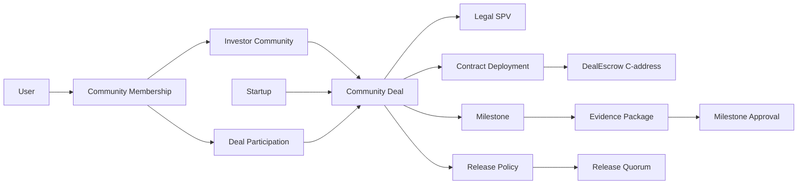
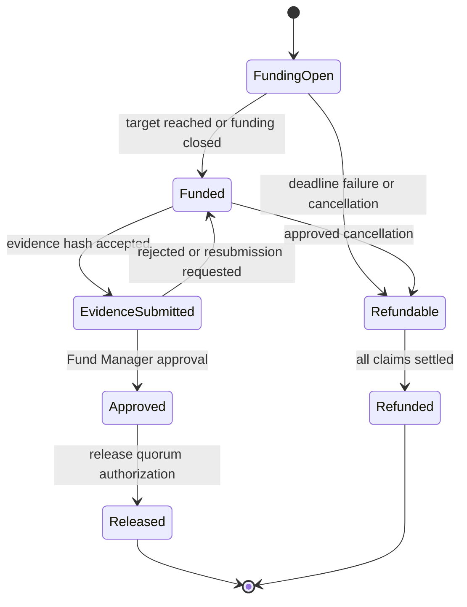

# Kori Stellar/Soroban PRD

## Document control

| Field             | Value                                                          |
| ----------------- | -------------------------------------------------------------- |
| Status            | Living draft and implementation handoff                        |
| Audience          | Kori developers, reviewers, and coding agents                  |
| Scope             | Stellar/Soroban blockchain path and its application boundaries |
| Last verified     | 2026-08-24                                                     |
| Working branch    | `liobrasil/stellar-soroban-escrow`                             |
| Target network    | Stellar Testnet only for the MVP                               |
| Production status | Not production-ready; no real funds                            |

After this branch is merged, this document is the blockchain reference on
`main`. It supersedes the blockchain sections of older repository documents
that still prescribe Ethereum Sepolia, MetaMask, or Safe. It does not turn an
item marked **OPEN** or **PROPOSED** into an approved product decision.

## 1. How to use this PRD

Labels are normative:

- **DECIDED**: current product or architecture direction.
- **IMPLEMENTED**: present in code and verified by tests or inspection.
- **REQUIRED**: acceptance criterion for the target MVP.
- **PROPOSED**: recommended design, awaiting explicit confirmation.
- **OPEN**: a decision is still required.
- **HISTORICAL**: useful context that must not drive new implementation.

Source precedence:

1. Explicit team decisions recorded in this PRD and the current
   [FigJam architecture](https://www.figma.com/board/FlcuMidYV5TAuMDfBc8l6o/Kori-Stellar-Architecture-%E2%80%94-Custody--Governance-and-Data?node-id=0-1).
2. Contract code and tests for implementation truth, not product intent.
3. Latest relevant team meetings and reviewed product flows.
4. [Architecture migration notes](./ARCHITECTURE_MIGRATION.md).
5. Older Sepolia/EVM documents, which are historical references only.

When sources conflict, do not silently choose one. Record the conflict here and
obtain a decision from the responsible product, blockchain, or legal owner.

### Agent/developer boot sequence

1. Read [`AGENTS.md`](../../AGENTS.md), this PRD, the package
   [README](./README.md), and the
   [architecture migration notes](./ARCHITECTURE_MIGRATION.md).
2. Inspect `git status`, the current branch, and recent commits. Preserve
   unrelated or pre-existing changes.
3. Read the [contract](./contracts/kori-deal-escrow/src/lib.rs) and
   [tests](./contracts/kori-deal-escrow/src/test.rs); never infer behavior from
   UI copy or a diagram alone.
4. Run the current validation commands before and after contract changes.
5. Update the implementation matrix and open decisions in this PRD in the same
   pull request when behavior changes.
6. Do not generate keys, deploy, push, merge, use real assets, or change external
   systems unless the task explicitly authorizes that action.

## 2. Executive summary

Kori demonstrates milestone-based private-market investment funding. Investors
fund a deal-specific escrow, a startup submits milestone evidence, AI provides
off-chain advice, a Fund Manager makes the human evidence decision, and a
separate release quorum authorizes the payout.

The selected Stellar model is:

1. The investor signs one `fund` invocation.
2. `DealEscrow` calls the USDC Stellar Asset Contract (SAC) in that invocation.
3. USDC moves from the investor G-account to the deal's C-address.
4. Evidence documents remain off-chain; hashes anchor integrity on-chain.
5. The Fund Manager approves the evidence hash.
6. A separate 2-of-N Stellar release quorum authorizes payout.
7. `DealEscrow` transfers the approved amount to the immutable startup account.
8. Kori indexes confirmed contract events into its operational database.

The deal contract holds the money; the multisig governs release. This is not a
treasury account holding the money, and it is not a revocable allowance that is
mislabelled as funded capital.

## 3. Architecture decisions

| ID     | Status       | Decision                                                                                                                      |
| ------ | ------------ | ----------------------------------------------------------------------------------------------------------------------------- |
| AD-001 | **DECIDED**  | New blockchain work targets Stellar/Soroban. EVM remains a historical reference implementation.                               |
| AD-002 | **DECIDED**  | Each deal uses contract custody: USDC is held at the `DealEscrow` C-address.                                                  |
| AD-003 | **DECIDED**  | Investor funding is an actual SAC transfer, not a deferred `approve`/allowance or delegated wallet pull.                      |
| AD-004 | **DECIDED**  | The MVP accepts one configured USDC SAC; asset identity includes the network and contract address.                            |
| AD-005 | **DECIDED**  | MVP scope is one deal, one startup, one milestone, and one full release.                                                      |
| AD-006 | **DECIDED**  | Fund Manager is a contextual community/deal role held by an investor, not a global `User.isFundManager` identity.             |
| AD-007 | **DECIDED**  | Human evidence approval and financial release authorization are separate responsibilities.                                    |
| AD-008 | **DECIDED**  | AI is advisory only and has no on-chain address, key, approval, or release power.                                             |
| AD-009 | **DECIDED**  | There is no separate independent-verifier role in the current flow; the Fund Manager is the human milestone approver.         |
| AD-010 | **DECIDED**  | A legal SPV and a smart contract are distinct objects linked to the same deal. A contract is not a legal vehicle.             |
| AD-011 | **PROPOSED** | Direct-deploy one escrow for the demo; add a factory only when multiple live deals justify it.                                |
| AD-012 | **OPEN**     | Exact release signers, value of N, signer weights, rotation, and emergency procedure. The board currently illustrates 2-of-N. |
| AD-013 | **OPEN**     | Funding target, deadline, overfunding policy, cancellation triggers, and refund policy.                                       |
| AD-014 | **OPEN**     | Whether founder evidence submission must be separately signed on-chain or only authenticated off-chain.                       |
| AD-015 | **OPEN**     | Upgrade policy. Recommendation: immutable after first funding, or governed upgrade with notice and investor exit.             |
| AD-016 | **OPEN**     | Community voting/quorum for selecting a deal. It cannot replace each investor's authorization of an exact funded amount.      |

## 4. Product boundary

### Goals

- Prove that investor funding corresponds to an atomic on-chain USDC transfer.
- Attribute every accepted contribution to the authorizing investor.
- Keep evidence and AI analysis off-chain while anchoring the approved package.
- Require a human milestone decision and separate quorum-controlled payout.
- Prevent early release, unauthorized release, over-release, and double release.
- Produce sufficient events for an auditable off-chain projection.
- Provide a reproducible local, Quickstart, and Testnet developer path.

### Non-goals for the MVP

- Mainnet or real-money use.
- Legal formation or administration of an SPV.
- Tokenized equity, cap-table ownership, securities issuance, or yield.
- Fiat conversion, on-ramp, off-ramp, CCTP, or cross-chain settlement.
- Production KYC/KYB, AML, sanctions, tax, or regulatory automation.
- Multiple milestones, partial tranches, multiple assets, or a deal factory.
- On-chain evidence documents or personally identifiable information.
- AI-controlled approvals or transactions.
- A reusable custom smart-wallet/account protocol.

## 5. Domain model

The reusable community and the deal-specific investment must remain separate.
One community can participate in several deals; one startup can receive funding
through several community deals or legal vehicles.



| Entity                | Meaning and required boundary                                                                                                       |
| --------------------- | ----------------------------------------------------------------------------------------------------------------------------------- |
| `User`                | Person/account identity. Base identity may be investor or founder; do not add a global fund-manager boolean.                        |
| `CommunityMembership` | User's scoped role in one community, such as member, manager, or lead investor. A user may have different roles across communities. |
| `InvestorCommunity`   | Reusable group of investors. It is not a wallet, deal, SPV, or startup.                                                             |
| `CommunityDeal`       | Aggregate root for one community investing in one funding opportunity/round for one startup.                                        |
| `DealParticipation`   | One member's committed and funded amounts for one deal. A membership balance is not a substitute.                                   |
| `Startup`             | Company/founder context. One startup may have multiple rounds/deals.                                                                |
| `LegalSPV`            | Optional legal vehicle and agreements associated with the deal. It does not execute code.                                           |
| `ContractDeployment`  | Network, contract ID, Wasm hash/version, constructor configuration, deployment transaction, and active status for a deal.           |
| `Milestone`           | Business criterion and release policy. The current MVP has exactly one.                                                             |
| `EvidencePackage`     | Versioned off-chain evidence manifest, URI, hash algorithm, schema version, and submitter.                                          |
| `MilestoneApproval`   | Human decision bound to an evidence package, approver, decision, and timestamp/ledger.                                              |
| `ReleasePolicy`       | Required authority, threshold, amount, recipient, and valid state for payout.                                                       |
| `ChainEvent`          | Immutable indexed network event identified by network, contract, ledger, transaction, and event ID.                                 |

Amounts shown at community, SPV, or startup level are derived aggregates. The
source of truth is each confirmed deal participation/funding event in one
explicit asset.

## 6. Actors and authority

| Actor                             | May do                                                                                         | Must not do                                                                     |
| --------------------------------- | ---------------------------------------------------------------------------------------------- | ------------------------------------------------------------------------------- |
| Investor                          | Select a deal, authorize an exact contribution, view funded position, claim an eligible refund | Move another investor's assets or approve a milestone by default                |
| Startup Founder                   | Upload evidence and, if AD-014 is approved, attest its hash                                    | Approve its own evidence or release funds                                       |
| Fund Manager / Milestone Approver | Review source evidence and AI advice; approve/reject the evidence hash for an assigned deal    | Gain release power merely from community-admin status                           |
| Release Signers                   | Satisfy the configured 2-of-N release authority                                                | Change evidence, recipient, amount, or deal rules while signing                 |
| Kori Operator                     | Deploy configured contracts, build/simulate/submit invocations, operate indexer                | Unilaterally move escrowed funds unless explicitly one of the disclosed signers |
| AI Review                         | Produce structured advisory findings off-chain                                                 | Hold keys, call the contract, approve, reject, or release                       |
| Legal/Compliance operator         | Determine eligibility and maintain legal records off-chain                                     | Treat a smart contract as formation of an SPV or proof of investment rights     |
| Stablecoin issuer                 | Operates the asset and may retain issuer controls                                              | Is not controlled by Kori                                                       |

Custody, control, and authority are different:

- **Custody location:** the DealEscrow C-address holds the SAC balance.
- **Business approval:** the Fund Manager approves the evidence.
- **Financial authorization:** the release quorum authorizes payout.
- **Execution:** DealEscrow enforces state and calls the SAC.
- **Legal rights:** the SPV and agreements define investor rights off-chain.

## 7. System architecture

### On-chain

- Investor and startup G-accounts.
- One verified USDC Stellar Asset Contract.
- One deal-specific `DealEscrow` C-address.
- Immutable or tightly governed deal configuration.
- Contribution, evidence-approval, release, and refund state.
- Structured events for every financial/state transition.
- Native Stellar G-account authorization for the release quorum.

### Kori off-chain platform

- Web application and API.
- Wallet connection, transaction simulation, assembly, signing, and submission.
- Operational database containing projections, not an alternative money ledger.
- Private evidence object store and versioned evidence manifest.
- AI advisory service.
- Stellar event indexer with replay and deduplication.
- Eligibility controls and role assignments.

### Legal/compliance

- SPV formation, documents, investor rights, and deal terms.
- KYC/KYB, AML/sanctions, suitability, jurisdiction, and disclosures.
- Dispute, cancellation, refund, and loss-allocation rules.

These are unresolved production workstreams. Testnet code must not imply they
are solved.

## 8. Required user and transaction flows

### 8.1 Deal configuration and deployment

1. Kori creates a canonical off-chain deal ID and terms/evidence schema version.
2. Product/legal owners provide the startup recipient and applicable deal terms.
3. Blockchain owner verifies network and USDC SAC identity.
4. The team assigns the deal-scoped Fund Manager and release quorum account.
5. Kori verifies the startup can receive the asset.
6. Kori deploys one escrow with reviewed constructor arguments.
7. Kori records network, contract ID, Wasm hash, constructor values, deployment
   transaction, and ledger.
8. No constructor value may be silently inferred from UI language, country, or
   wallet defaults.

### 8.2 Investor funding

1. Investor selects one deal and exact base-unit amount.
2. Any community selection vote is checked off-chain, but does not authorize
   spending from the investor's account.
3. The app reads the latest deal state and simulates the invocation.
4. The wallet shows and signs the complete `fund` authorization tree.
5. `fund` requires investor authorization.
6. DealEscrow calls SAC transfer from investor to escrow in the same invocation.
7. Contribution and aggregate accounting update atomically with the transfer.
8. DealEscrow emits `Funded`.
9. The indexer records the event only after successful confirmed execution.
10. The UI derives “funded” from confirmed chain evidence, never from a pending
    database row, allowance, signature request, or commitment.

### 8.3 Evidence and human approval

1. Founder uploads a versioned evidence package off-chain.
2. Kori canonicalizes a manifest and computes its versioned hash.
3. AI returns advisory findings referencing the same evidence version.
4. Fund Manager inspects the underlying evidence and advisory result.
5. Fund Manager approves or rejects the exact evidence hash.
6. The chain stores only the hash, decision state, and approver/ledger data.
7. Re-submission produces a new evidence version and hash; history is never
   overwritten off-chain.

### 8.4 Release

1. The app constructs a release authorization containing the contract, evidence
   hash, amount, and immutable recipient/deal context.
2. Required release signers satisfy the configured 2-of-N G-account threshold.
3. DealEscrow checks evidence approval, release arguments, balance/accounting,
   recipient, and current state.
4. DealEscrow marks the terminal state and transfers USDC atomically.
5. DealEscrow emits `Released` with the amount and evidence reference.
6. The indexer projects the confirmed state and transaction identifiers.

The current zero-argument `release()` is not sufficient for the target design:
the quorum signature is not explicitly bound to an evidence hash and amount,
and the Fund Manager can replace the stored approval before release. This is a
high-priority contract change.

### 8.5 Refund/cancellation

**OPEN:** exact triggers and deadlines require product/legal approval.

If included, the safe implementation is a pull refund:

1. A deterministic deadline or authorized cancellation enters `Refundable`.
2. Release becomes impossible.
3. Each investor calls `claim_refund` for their own remaining contribution.
4. The contract authenticates the investor, zeroes their refundable amount, and
   transfers atomically.
5. The contract never loops over every investor.

## 9. Target state machine

This is **PROPOSED** until AD-013 is resolved.



Terminal states cannot reopen. AI output causes no state transition by itself.

## 10. On-chain functional requirements

| ID     | Priority | Requirement                                                                                          | Current status                                        |
| ------ | -------- | ---------------------------------------------------------------------------------------------------- | ----------------------------------------------------- |
| FR-001 | P0       | Constructor stores one asset, startup, Fund Manager, and release authority atomically.               | **IMPLEMENTED**                                       |
| FR-002 | P0       | Config also anchors deal ID/schema, target/release amount, deadline, and terms hash when approved.   | **MISSING / OPEN inputs**                             |
| FR-003 | P0       | `fund(investor, amount)` requires investor auth, positive amount, valid state, and SAC transfer.     | **IMPLEMENTED**, but no target/deadline/state gate    |
| FR-004 | P0       | Track cumulative contribution per investor and aggregate accepted funding in base units.             | **IMPLEMENTED**                                       |
| FR-005 | P0       | Reject overfunding or apply an explicitly approved excess policy.                                    | **MISSING**                                           |
| FR-006 | P0       | Store/version founder evidence submission if AD-014 requires on-chain attestation.                   | **MISSING / OPEN**                                    |
| FR-007 | P0       | Fund Manager approval binds exact evidence hash, version, and approved release amount.               | **PARTIAL**; hash only, replaceable                   |
| FR-008 | P0       | Release authorization binds exact evidence hash and amount; startup is immutable.                    | **MISSING**; current `release()` has no arguments     |
| FR-009 | P0       | Release requires separate authority and is terminal/atomic.                                          | **IMPLEMENTED** for one address                       |
| FR-010 | P0       | Exercise a real 2-of-N G-account threshold in integration tests.                                     | **MISSING**                                           |
| FR-011 | P0       | Implement explicit deal state transitions rather than optional approval plus `released` boolean.     | **MISSING**                                           |
| FR-012 | P1       | Cancellation and per-investor pull refunds follow approved policy.                                   | **MISSING / OPEN**                                    |
| FR-013 | P0       | Amount released/refunded never exceeds accounted accepted funding.                                   | **PARTIAL**; release currently sends full SAC balance |
| FR-014 | P0       | Define treatment of direct/unattributed SAC transfers to the C-address.                              | **OPEN**                                              |
| FR-015 | P1       | Extend or operationally maintain TTL for instance, persistent contribution, and Wasm entries.        | **MISSING**                                           |
| FR-016 | P0       | Emit versioned events for funding, evidence submission/approval, release, cancellation, and refund.  | **PARTIAL**                                           |
| FR-017 | P1       | Expose deterministic views for config, state, contribution, approval, refundable amount, and totals. | **PARTIAL**                                           |
| FR-018 | P1       | Freeze upgrades after first funding or enforce approved governed upgrade/exit policy.                | **OPEN**; no upgrade entry point today                |

### Core invariants

- Accepted amounts are positive `i128` base units and arithmetic cannot overflow.
- Asset identity, startup recipient, deal, and network cannot change after
  funding begins.
- Every recorded contribution corresponds to a successful SAC transfer.
- `total_released + total_refunded <= total_accepted_funding` always.
- An investor cannot withdraw another investor's refundable balance.
- No release before the exact milestone evidence is approved.
- Founder and AI cannot approve or release.
- Community administration does not automatically grant release authority.
- A release authorization cannot be replayed for different evidence, amount,
  recipient, contract, or network.
- `Released` and `Refunded` are mutually exclusive terminal outcomes.
- State and token movement roll back together on failure.
- No PII or evidence document content is stored on-chain.

## 11. Event and database requirements

Minimum event data:

| Event                    | Required fields                                                    |
| ------------------------ | ------------------------------------------------------------------ |
| `Funded`                 | investor, amount, resulting investor contribution, resulting total |
| `EvidenceSubmitted`      | submitter if on-chain, evidence hash, schema/version               |
| `MilestoneApproved`      | Fund Manager, evidence hash, amount, decision version              |
| `Released`               | startup, amount, evidence hash                                     |
| `Refundable`/`Cancelled` | reason code, effective ledger/deadline                             |
| `Refunded`               | investor, amount                                                   |

The operational database must store at least:

- network/passphrase identifier;
- contract ID and Wasm hash/version;
- asset SAC address and issuer/code metadata;
- transaction hash and ledger sequence;
- unique event ID/cursor and event index;
- decoded event schema version and payload;
- ingestion timestamp and confirmation/result status.

Event ingestion must be idempotent. Stellar RPC keeps only a bounded recent
event window (stock default is about seven days), so Kori must continuously
ingest and deduplicate events. The database is a query projection; on-chain
state and successful asset movement remain authoritative for settlement.

## 12. Evidence requirements

An evidence hash is only meaningful if its preimage is deterministic. Define:

- canonical manifest schema and version;
- hash algorithm, currently proposed SHA-256;
- ordered file list with each file's hash, size, MIME type, and storage object ID;
- milestone/deal identifiers;
- submitter and submission timestamp;
- previous evidence version when resubmitted;
- AI model/provider/version and advisory output hash;
- Fund Manager decision, reason, and approved evidence version.

Never hash an arbitrary JSON serialization without canonicalization. Evidence
URIs must not expose private documents publicly, and deleting a document must
follow the legal retention policy rather than silently breaking the audit trail.

## 13. EVM-to-Stellar mapping

| EVM mental model                       | Stellar/Soroban model                                         | Kori implication                                                                              |
| -------------------------------------- | ------------------------------------------------------------- | --------------------------------------------------------------------------------------------- |
| ERC-20 token contract                  | Stellar Asset Contract (SAC) implementing SEP-41              | Configure the exact USDC SAC per network.                                                     |
| `approve` then `transferFrom`          | `require_auth` plus nested SAC transfer in one invocation     | One investor signing interaction can produce real funding; no standing allowance is required. |
| EOA                                    | G-account                                                     | Investor, startup, and native multisig use G-addresses.                                       |
| Contract address                       | C-address                                                     | DealEscrow holds USDC at its C-address.                                                       |
| `msg.sender` checks                    | `Address::require_auth()`                                     | Host verifies authorization and replay protection.                                            |
| Safe as authorized caller              | Native Stellar G-account with signer weights/medium threshold | Multisig account authorizes `release`; it need not hold the funds.                            |
| Solidity revert                        | Soroban error/panic with atomic rollback                      | Storage and SAC calls revert together.                                                        |
| Hardhat/Anvil node                     | Quickstart                                                    | Full local RPC/Core/Horizon/Friendbot integration requires Quickstart.                        |
| Foundry unit test                      | Soroban embedded host plus mock ledger                        | Fast contract-level tests are not proof of network/client integration.                        |
| Persistent contract storage assumption | Instance/Persistent storage with TTL and archival             | Add TTL maintenance and restoration operations.                                               |
| Long-lived event provider              | RPC with bounded event retention                              | Run an indexer and deduplicate events.                                                        |

Do not assume EVM USDC's six decimals. Use SAC base units and verify the
configured token's `decimals()` value in client and integration tests.

## 14. Current implementation truth

### Code baseline

- Original Soroban implementation commit: `b4f0f52`.
- Developer onboarding commit: `f82db60`.
- Workspace SDK: `soroban-sdk = "27.0.6"`.
- Contract: [`KoriDealEscrow`](./contracts/kori-deal-escrow/src/lib.rs).
- Build artifact: `target/wasm32v1-none/release/kori_deal_escrow.wasm`.
- No contract ID, deployment transaction, Testnet account, or Testnet end-to-end
  run is recorded in the repository.

### Implemented API

- `__constructor(asset, startup, fund_manager, release_authority)`
- `fund(investor, amount)`
- `approve_milestone(evidence_hash)`
- `release()`
- `config()`
- `contribution(investor)`
- `total_funded()`
- `milestone_approval()`
- `is_released()`

### Current storage

- Instance: config, total funded, approval, released flag.
- Persistent per investor: cumulative contribution.
- No TTL extension logic.

### Current events

- `Funded(investor, amount)`
- `MilestoneApproved(fund_manager, evidence_hash)`
- `Released(startup, amount)`

### Current tests

Seven embedded-host tests cover:

1. Complete funding, approval, and full release.
2. Non-positive funding rejection.
3. Cumulative repeated contribution accounting.
4. Release rejection before approval.
5. Approved but empty escrow rejection.
6. Double-release rejection.
7. Expected role authorization entries.

The fixture calls `mock_all_auths()`. This proves which addresses the contract
requests, not that a real wallet, signature, transaction assembly, or 2-of-N
account works end-to-end.

### Honest readiness scores

| Area                                           | Score | Reason                                                                                                                  |
| ---------------------------------------------- | ----- | ----------------------------------------------------------------------------------------------------------------------- |
| Selected custody/authority design for the demo | 8/10  | Simple and Stellar-native; key policy details remain open.                                                              |
| Current code coverage of the FigJam target     | 5/10  | Core funding/approval/release exists; evidence submission, refund, state machine, indexer, and real quorum are missing. |
| Raw Testnet deployment readiness               | 7/10  | Wasm builds, but no deployment/configuration runbook has been exercised.                                                |
| Complete Testnet demo readiness                | 4/10  | No account/trustline setup, real USDC flow, multisig integration, app client, or event projection.                      |
| Production readiness                           | 2/10  | Legal model, refund rules, audit, operations, incident controls, and production integration are unresolved.             |

## 15. Required test strategy

### Level 1: embedded host

Fast Rust tests for contract logic. Keep these deterministic and offline.

Add tests for:

- exact release binding to evidence hash and amount;
- approval replacement/version rules;
- explicit state transitions and forbidden transitions;
- funding target, close, deadline, and overfunding policy;
- multiple investors and partial refund claims;
- release/refund mutual exclusion;
- wrong investor, founder, manager, and release authority;
- amount overflow boundaries;
- direct/unattributed asset transfer policy;
- event payload/version correctness;
- TTL extension behavior;
- failed SAC transfer rollback;
- post-terminal funding, approval, release, and refund rejection.

Use explicit auth mocks for negative authorization tests where possible. Do not
use `mock_all_auths()` as the only proof of an authority boundary.

### Level 2: Wasm/local network

Use the compiled Wasm and Quickstart to test:

- upload/deployment and constructor values;
- real G-accounts and asset trustlines;
- simulation, footprint, fees, assembly, signing, and submission;
- investor-to-C-address and C-address-to-startup SAC transfers;
- native 2-of-N signer weights and medium threshold;
- events through RPC and indexer deduplication;
- restore/TTL behavior where practical.

### Level 3: public Testnet

Run the same business sequence with the verified Testnet USDC SAC, record every
address and transaction, and verify balances independently. Testnet success is
not a security audit or Mainnet approval.

## 16. Development and validation

Run from `packages/stellar-contracts`:

```bash
rustup target add wasm32v1-none
cargo fmt --all -- --check
cargo test
cargo clippy --all-targets -- -D warnings
RUSTDOCFLAGS="-D warnings" cargo doc --no-deps
cargo build --target wasm32v1-none --release
```

Current expectation: seven tests pass until requirements add new tests.

Environment ladder:

| Environment                 | What it proves                                                        | What it does not prove                                                       |
| --------------------------- | --------------------------------------------------------------------- | ---------------------------------------------------------------------------- |
| Embedded host + mock ledger | Contract logic, storage, events, requested auth trees                 | RPC, consensus, real signatures, multisig, trustlines, transaction lifecycle |
| Quickstart                  | Full local Stellar services and client integration                    | Public-network configuration and third-party infrastructure                  |
| Testnet                     | Shared-network accounts, transactions, SAC, RPC, and operational flow | Production safety, legal readiness, Mainnet reliability                      |

Start/stop Quickstart only when needed:

```bash
stellar container start local
stellar container stop local
```

## 17. Build plan and acceptance gates

### Gate A: resolve product/security inputs

Owners: product, blockchain, and legal/compliance.

- Confirm release signer identities, N, weights, rotation, and recovery.
- Confirm target, funding deadline, overfunding, cancellation, and refund rules.
- Confirm founder on-chain evidence authorization.
- Confirm release amount and whether a full release means target, accepted total,
  or actual contract balance.
- Confirm immutable versus governed-upgrade policy.

**Exit:** AD-012 through AD-015 have recorded decisions and testable rules.

### Gate B: harden the contract

- Add explicit state machine and missing immutable deal configuration.
- Bind approval/release to evidence, amount, and recipient.
- Add target/close/deadline controls.
- Implement pull refunds if approved.
- Define direct-transfer/excess behavior.
- Add versioned events and TTL strategy.
- Expand unit and invariant tests.

**Exit:** all P0 requirements pass embedded-host tests, clippy, Rustdoc, and Wasm
build; no unexplained deviation from this PRD.

### Gate C: local full-stack blockchain integration

- Add reproducible Quickstart scripts/configuration.
- Configure local accounts, mock asset, trustlines, and 2-of-N release account.
- Exercise deployment and complete funding-to-payout/refund paths through RPC.
- Capture deployment manifest and Wasm hash.

**Exit:** a clean machine can reproduce the local E2E run from documentation.

### Gate D: Testnet deployment

- Re-verify current network/software versions and USDC identifiers.
- Create named Testnet-only accounts and fund network fees through Friendbot.
- Establish/verify necessary USDC trustlines and obtain test asset.
- Configure the native multisig release account.
- Deploy reviewed Wasm and record the deployment manifest.
- Execute and independently verify one complete deal lifecycle.

**Exit:** transaction hashes, ledgers, contract ID, Wasm hash, constructor config,
balances, events, and known limitations are published in a Testnet runbook.

### Gate E: application and data integration

- Add Stellar wallet/client support to `packages/web3` and `apps/web`.
- Simulate before requesting signatures; assemble using RPC results.
- Display exact network, asset, amount, contract, and recipient.
- Implement private evidence storage and canonical hashing.
- Implement AI advisory output with provenance.
- Implement indexer, deduplication, reorg/result handling, and DB projection.
- Replace misleading EVM/Safe simulator language in the active Stellar flow.

**Exit:** the UI executes the real Testnet flow and clearly labels mocked versus
live components.

### Gate F: production consideration

- Legal/regulatory/custody analysis and documented operating model.
- Threat model, independent security review, audit, and remediation.
- Key management, signer recovery, incident response, monitoring, and alerting.
- Production stablecoin/network due diligence and issuer-control disclosure.
- Load/resource testing, archival operations, backup/rebuild, and runbooks.
- Controlled rollout with explicit value limits.

**Exit:** requires separate approval. Passing the Testnet gates is insufficient.

## 18. Testnet configuration reference

As verified from official Stellar documentation on 2026-08-24:

| Property           | Testnet value                                              |
| ------------------ | ---------------------------------------------------------- |
| Asset code         | `USDC`                                                     |
| Issuer             | `GBBD47IF6LWK7P7MDEVSCWR7DPUWV3NY3DTQEVFL4NAT4AQH3ZLLFLA5` |
| SEP-41/SAC address | `CBIELTK6YBZJU5UP2WWQEUCYKLPU6AUNZ2BQ4WWFEIE3USCIHMXQDAMA` |

Re-verify these values before every deployment. Asset code alone is not an
identity. Testnet may reset and clear accounts, trustlines, balances, contracts,
and history; deployment must be reproducible.

After explicit deployment authorization, the standard account bootstrap is:

```bash
stellar keys generate <test-identity> --network testnet --fund
stellar keys address <test-identity>
```

Never commit secret keys. Add an audited deployment script/runbook before using
constructor commands in team workflows rather than relying on copied terminal
history.

## 19. Security, custody, and legal constraints

- Contract custody is still custody/control by code; do not call it
  “non-custodial” without a precise legal and technical definition.
- A Stellar stablecoin issuer may retain authorization, freeze, revocation, or
  clawback capabilities. Kori cannot guarantee immunity from issuer action.
- A release quorum protects one authority boundary; it does not repair incorrect
  deal terms, compromised evidence storage, bad constructor values, or unsafe
  upgrade/refund logic.
- A smart contract cannot form an SPV, establish securities ownership, or
  replace signed legal agreements.
- No real capital should enter the prototype. Mainnet use requires legal review,
  independent contract review/audit, and an approved operating model.
- AI findings must be labelled advisory, traceable, and reviewable by the human
  approver.

## 20. Open decision register

| Decision                                                          | Owner                   | Blocking                           |
| ----------------------------------------------------------------- | ----------------------- | ---------------------------------- |
| Exact 2-of-N signers, weights, rotation, and recovery             | Product + Blockchain    | Local multisig and Testnet E2E     |
| Funding target/close/deadline and overfunding                     | Product                 | State machine and hardened funding |
| Cancellation/refund triggers and dispute treatment                | Product + Legal         | Refund implementation              |
| Founder on-chain evidence signature                               | Product + Blockchain    | Final evidence flow/API            |
| Evidence canonicalization and retention                           | Product + Backend/Legal | Stable approval hash               |
| Full-release amount definition                                    | Product + Blockchain    | Bound release API                  |
| Direct/unattributed transfers                                     | Blockchain + Product    | Accounting invariant               |
| Upgrade/immutability policy                                       | Product + Security      | Deployment architecture            |
| Fee payer/sponsorship and wallet choice                           | Product + Frontend      | Client integration                 |
| KYC/eligibility enforcement boundary                              | Legal + Backend         | Production consideration           |
| SPV-to-deal legal relationship and authoritative ownership ledger | Legal                   | Production consideration           |
| Community deal-selection voting/quorum                            | Product + Backend       | Community governance flow          |

## 21. Definition of done for the Testnet MVP

The MVP is done only when:

- one reviewed escrow is reproducibly deployed to Testnet;
- one or more investors fund it with verified Testnet USDC through signed
  invocations;
- confirmed contributions reconcile with SAC transfers and indexed events;
- a founder evidence package is stored privately with a canonical on-chain hash;
- AI produces advisory output only;
- the assigned Fund Manager approves the exact evidence version;
- a separately configured real 2-of-N G-account authorizes the exact release;
- the contract pays the immutable startup address once and cannot replay;
- the UI and database show confirmed network state and transaction references;
- failure paths and any approved refund path are demonstrated;
- all validation commands pass and a clean-machine runbook reproduces the flow;
- every screen and document states Testnet/demo limitations accurately.

## 22. Change protocol for humans and agents

Every blockchain pull request must state:

1. Requirement/decision IDs changed.
2. Files and contract interface changed.
3. New or changed invariants.
4. Tests run and exact results.
5. Network/deployment actions, or explicitly “none.”
6. Security, custody, legal, or compatibility impact.
7. Remaining gaps and open decisions.

Do not mark a requirement implemented because code exists. It is implemented
only when the relevant deterministic test passes and documentation reflects the
actual behavior. A Git push is not proof of deployment, and a deployment is not
proof of application integration or production readiness.

## 23. References

### Kori sources

- [Current Stellar custody, governance, and data FigJam](https://www.figma.com/board/FlcuMidYV5TAuMDfBc8l6o/Kori-Stellar-Architecture-%E2%80%94-Custody--Governance-and-Data?node-id=0-1)
- [Kori Standup — 2026-08-17](https://app.fireflies.ai/view/01M08XMKEP2EPQ9GVX48FXZY61)
- [Smart contract meeting — 2026-08-19](https://app.fireflies.ai/view/01M0E54WP3C6NE0XWRHQVPGCQH)
- [Allocation/transaction worksheet](https://docs.google.com/spreadsheets/d/1RMGdhWMD8l1NyNhiEonpSnoI0LrQFO2rLUqFsrwbMVo/edit?gid=0#gid=0) — access-controlled supplemental context; not used as an authoritative live source in this verification pass.
- [Stellar package README](./README.md)
- [EVM-to-Stellar migration notes](./ARCHITECTURE_MIGRATION.md)
- [Soroban contract](./contracts/kori-deal-escrow/src/lib.rs)
- [Soroban tests](./contracts/kori-deal-escrow/src/test.rs)
- [Historical EVM escrow](../contracts/contracts/KoriEscrow.sol)

### Official Stellar sources

- [Authorization and native Stellar multisig](https://developers.stellar.org/docs/learn/fundamentals/contract-development/authorization)
- [Contract lifecycle and embedded host](https://developers.stellar.org/docs/learn/fundamentals/contract-development/contract-lifecycle)
- [Quickstart](https://developers.stellar.org/docs/tools/quickstart/getting-started)
- [Deploy to Testnet](https://developers.stellar.org/docs/build/smart-contracts/getting-started/deploy-to-testnet)
- [Current software versions](https://developers.stellar.org/docs/networks/software-versions)
- [Testnet USDC identifiers](https://developers.stellar.org/docs/build/agentic-payments/x402#testnet-usdc)
- [Stellar Asset Contract](https://developers.stellar.org/docs/tokens/stellar-asset-contract)
- [State archival and TTL](https://developers.stellar.org/docs/learn/fundamentals/contract-development/storage/state-archival)
- [RPC event retention](https://developers.stellar.org/docs/data/apis/rpc/api-reference/methods/getEvents)
- [Event ingestion](https://developers.stellar.org/docs/build/guides/events/ingest)

### Historical repository context

The following files contain useful product/UI history but stale EVM blockchain
direction. Their Sepolia, MetaMask, Safe, and “do not use Stellar” statements
must not override this PRD after merge:

- [`docs/context/PROJECT_CONTEXT.md`](../../docs/context/PROJECT_CONTEXT.md)
- [`docs/context/ARCHITECTURE_DECISIONS.md`](../../docs/context/ARCHITECTURE_DECISIONS.md)
- [`docs/context/BUILDATHON_REMAINING_WORK.md`](../../docs/context/BUILDATHON_REMAINING_WORK.md)
